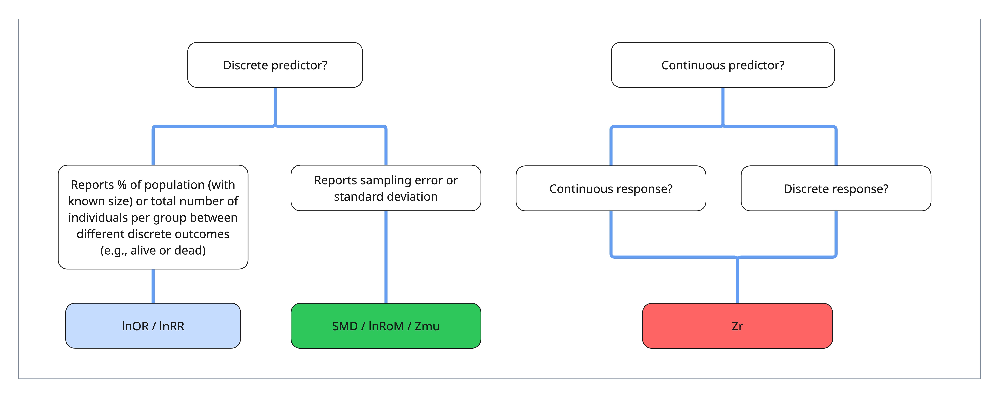

```{r}
#| echo: false
#| eval: true
#| output: false

library("simplermarkdown")
# library("glossary") 
# glossary_path("glossary.yml")
# glossary_style("purple", "underline")

```

**I tried adding glossary popup definitions...It works inconsistently....It'll be integrated eventually though**

Meta-analytic effect sizes are statistics that summarize statistical distributions. Meta-analytic effect sizes allow researchers to synthesize data across different studies to answer big questions and to generate overall synthetic estimates. Effect sizes are no trivial thing: they are tiny models, with their own assumptions, rules of interpretation, and numeric challenges.

Meta-analytic effect sizes have two parts: the **point estimate** and **sampling variance**. Point estimates are the target of interest. For example, the difference in cancer rates between two treatment groups, the proportional change in average body size between two treatments, the relationship between two continuous variables, or even just a description of a single overall condition. 

Sampling variance is the associated uncertainty around these estimates, based on sample size and/or standard deviation. Both point estimates and sampling variance are essential to fit meta-analytic models because sampling variance is used as a weight. In this way, effect sizes with *lower* sampling variance have higher weight in meta-analytic models. 

This relationship is key to meta-analysis and means that instead of simply tallying the number of studies in-support or not of a given question, we can produce a weighted average---and we can conduct metaregression to ask how other variables influence our question.

::: callout-note
##### Random effect meta-analytic models reduce the influence of sampling variance

In a common-effects meta-analytic model (which we don't recommend in ecology and evolution), an effect size's weight is one over its sampling variance ($1/vi$). In the random-effects and multilevel models you will actually fit, weight is one over the sampling variance *plus* the between-study variance $\tau^2$. That extra term acts as a floor on everyone's uncertainty and compresses the differences between studies considerably: with a moderate $\tau^2$ of $0.1$, a twentyfold gap in sampling variance shrinks to roughly fivefold. Large studies still dominate, but far less than the raw sample sizes suggest.

**Sometimes this feels too soon. I think there are some questions about audience---how much do they already know when they read this? Perhaps we need a section here that's more generally instructive**
:::

# Effect size types {#sec-effect-size-types}

We commit the majority of this tutorial to effect sizes that are concerned with the difference in central tendencies (i.e., means) of a response variable between two groups (i.e., a categorical variable) or in relationship to a continuous predictor variable:

1)  standardized mean difference (SMD) and log-transformed ratio of means (lnRoM)

2)  log odds ratio (lnOR) and log risk ratio (lnRR)

3)  correlation coefficient (Zr)

:::callout-note
### Standardized and unstandardized effect sizes
The effect sizes in this tutorial in this tutorial are **standardized**, which allows comparison across different units of measurement. However, in some disciplines, it is customary to use unstandardized effect sizes (such as mean difference), because standardized research protocols ensure that all studies use the same scale of measurement.
:::

These three effect size classes are determined by the types of data involved in your research question. In particular, whether the response and predictors variables are continuous or discrete.


**All schematic figures will be redone and made pretty...And we all have to make a decision about WHAT figures to have**
 

When the response variable is continuous and compared between two groups, for instance comparing between a control and experimental treatment, then the effect sizes you can use are Standardized Mean Difference (**SMD**) or the log-transformed ratio of means (**lnRoM**, also referred to as the log response ratio or lnRR). These effect sizes differ in their intention, interpretability, and mathematical assumptions, which we cover [here.](2.1-SMD-assumptions.qmd). 

When the response is a binary outcome, e.g., the number or percent that lived or died, compared between two groups, we analyze the data as log odds ratio (**lnOR**) or the log risk ratio (**lnRR**). This is the type of data you may encounter in contingency tables and would, in an introductory stats class, learn to analyze with a Chi-square goodness of fit test.

:::callout-important
Note that many refer to lnRoM as lnRR (the log response ratio). However, lnRR is also the abbreviation for the log risk ratio (see below). For that reason we use lnRoM throughout this tutorial to refer to log-transformed ratio of means and lnRR to refer to log risk ratio. 
:::

Correlations between two continuous variables are analyzed as Fisher's r-t-z-transformed correlation coefficients (**Zr**). These generally involve continuous predictor and response variables. However, you can also calculate correlation coefficients for discrete predictors and discrete responses, which may be necessary in some peculiar cases. This is the workhorse for meta-analyses based on observational data.

Finally, it is also possible to convert between these main effect size types, which we discuss [here](4-converting-effect-sizes.qmd). This may be important when you find yourself with limited data. If your dataset is small, sticking to one effect size type may bias your results by excluding otherwise usable data [@borenstein2021] or splitting your data into many separate models, each of which lack statistical power. However, we suggest that care should be taken in ensuring that data is comparable, especially in terms of the [*unit of replication*](3.1-universal-challenges.qmd#sec-sample-size).

Finally, we note that there are other effect size types that may be complimentary or alternatives to the effect sizes we describe above. These include effect sizes for estimating differences in variability between two groups [(lnCVR)](5.1-variability-between-groups.qmd) [@Nakagawa2015-tq], differences in magnitude between two groups regardless of direction [(lnM)](5.2-differences-in-magnitude.qmd) [@Nakagawa2026-wn], and effect sizes for [single-group descriptive statistics](5.3-single-group-effect-sizes.qmd). 

:::callout-important
### Effect size types are not always clearcut {#sec-effect-size-options}

The choice of what effect size to use may seem very simple. For example, if you are analyzing studies that report a continuous response variable between two groups, then SMD/lnRoM effect sizes seem like the obvious choice. 

However, this can sometimes be misleading. For example, imagine you're meta-analyzing the effect of a predator on the abundance of their prey [like in [@Wallach2025-ta]]. Many studies present results that look like SMD-type data: comparing mean±SD of prey abundance in areas with high predator abundance to areas with low predator abundance, due to a culling treatment. However, the 'low' predator treatment still has predators---albeit at lower density.

If you use an SMD or lnRoM-type effect size, then you should treat the *difference* in density between treatments as a moderator in your meta-analytic models. This can lead to complex models, especially if you are interested in evaluating the influence of other moderators---because each would then need an interaction to this density variable.

An alternative is to calculate [Zr](2.3-Zr-assumptions.qmd) correlation coefficients for this data, treating the predator density as a continuous predictor. These decisions are non-trivial and should be carefully thought through. 

In some situations, even experimental data may, potentially, be better analyzed as a single-group effect sizes if most studies used >2 experimental groups or if experimental treatments were extremely heterogeneous (e.g., different temperature treatments or pesticide dosages). Instead of calculating effect sizes that explicitly compare each experimental treatment to a control, you could calculate single group effect sizes for each group, and then use the experimental groups explicitly (e.g., the temperature of each treatment) as predictors in your meta-analytic model. 

**Are there statistical reasons not to? E.g., inflating sample size?**

This applies both to continuous data summarized by mean±sd as well as proportions (binary outcome data). We describe single-group effect sizes for means and proportions in the appendix, [here](5.3-single-group-effect-sizes.qmd).

Finally, it is also possible to formulate custom effect sizes that may help simplify these situations by explicitly including sources of nuisance heterogeneity in your effect size calculation. See our section [below](#sec-custom-effect-sizes) and @Noble2022-pl for discussion about the potential to formulate custom effect sizes.
:::

# How to calculate effect sizes & sampling variance {#sec-calculating-effect-sizes}

The dominant function used to calculate effect sizes and sampling variance in `R` is the function `escalc` in the package `metafor` [@Viechtbauer2010-uq]. `escalc` takes effect-size-specific summary statistics and a variable specifying the effect size type (specified with the `measure` argument).

At certain points we will also use our own custom function, `eff_size` **(currently called eff_size but eff_this could be funny...)** which can do most of what `escalc` can do but also a few niche things that `escalc` currently doesn't support.

To start, we'll clean the environment and we will install a custom package, `metatools`, that we developed to go alongside this tutorial. `metatools` contains the function `eff_size` and a function for converting between effect sizes (`convert_effect_sizes`, see our tutorial [here](4-converting-effect-sizes.qmd)). 

We'll install `metatools` with `pak::pak` and we'll load `metafor`, the workhorse of meta-analysis in R:

```{r}
#| eval: true
#| echo: true
#| out-width: "70%"

rm(list = ls())

if(!requireNamespace("metatools")) {
  pak::pak("ejlundgren/metatools")
}

library("metatools")
library("metafor")

# Also load dplyr for some data stuff down the line:
library("dplyr")
```

Calculating an effect size with either of these functions is easy. Let's demonstrate with a study that compared the mean±SD between two groups. With `escalc`, `m1i` and `m2i` are the means of group 1 and 2, `sd1i` and `sd2i` are the standard deviations (not standard errors!) of groups 1 and 2, and `n1i` and `n2i` are the sample sizes. The effect size type is specified with the `measure` argument. Here we'll calculate Standardized Mean Difference (SMD):

```{r}
#| eval: true
#| echo: true
#| out-width: "70%"

escalc(measure = "SMD",
       m1i = 12, m2i = 10, 
       sd1i = 1.5, sd2i = 1.7,
       n1i = 15, n2i = 17)
```

The effect size point estimate is returned as `yi` and the sampling variance as `vi`.

In `eff_size`, this is similar except that the argument names are slightly different (`x` instead of `m` for the means and no `i`) **(I can change it to m1 or m2)**

```{r}
#| eval: true
#| echo: true
#| out-width: "70%"

eff_size(effect_type = "SMD",
         x1 = 12, x2 = 10, 
         sd1 = 1.5, sd2 = 1.7,
         n1 = 15, n2 = 17)
```

`eff_size` is useful in some cases. Primarily because `eff_size` has built in functionality to calculate [**lnM**](5.2-differences-in-magnitude.qmd) with a fancy bootstrapping method, which we'll discuss later. 

`eff_size` also, by switching `default_formulas = FALSE`, returns multiple estimators of the same effect size. 

Now, you may be thinking, what the hell is an estimator? Why are there multiple estimators for the same effect size? 

Let us explain. We'll start by talking about **estimands**, which is what estimators are trying to estimate. 

# Estimands, estimators, and estimates {#sec-estimates-and-estimators}

**Maybe this should move to top of page?**

The word **estimand** looks like a typo. But it isn't. An **estimand** is the target of a study: the precise thing we want to know. For example, are patients more likely to survive when given a drug relative to a placebo group? Does selective logging lead to higher soil carbon than clearcutting? 

These are all estimands: the theoretical target. Primary studies and meta-analytic studies are all aiming to **estimate** an **estimand**.

There are 5 attributes to estimands:

1. The target population: who or what does the question apply to? 

> Which patients are we trialling the drug on? Are we evaluating logging in all forests or in boreal forests? 

2. What is the treatment that we're interested in? 

> What drug and at what dosage? How is "selective" logging defined relative to "clearcutting"?

3. What endpoint are we interested in? 

> Survivorship, species richness, biomass, soil carbon, and so on

4. How does our estimand deal with unexpected events?

> How does the estimand handle death from other causes in our patients or wildfire or flooding in our logging experiment?

5. How do we summarize the effect of the treatment?

> Is the outcome of interest odds of survival of individuals between the placebo and control group? The ratio of species richness between logging treatments? Or the difference in richness between logging treatments?

:::callout-important
You might note that these attributes mirror the PECOS framework (Population, Exposure, Comparator, Outcome), which is widely used for designing meta-analysis [@Morgan2018-za]. 
:::

These questions are essential to consider when designing a meta-analysis and choosing the effect size to use. 

:::callout-note
One issue with meta-analysis is that we are often forced to include studies that had different primary study-level **estimands**. In these cases, the meta-analytic model may be making an overall effect for studies that are concerned with fundamentally different things. 

This is especially true if you're including both experimental and observational (or quasi-experimental) data. Experimental data generally concerns the same target population as the control population. However, observational or quasi-experimental data are forced to compare separate populations. **CITE BECKS ONCE PREPRINTED**

This is not to say that conducting a meta-analysis is not a worthy use of time---it is still the best way to synthesize knowledge---but that attention to study level estimands can help you be humble and honest about your meta-analytic results.

:::

Estimands also have a mathematical dimension: the *true* mathematical relationship of interest. For instance, Standardized Mean Difference (SMD) describes the *difference* in a continuous outcome between two treatment groups. It is defined as:

$$
\begin{aligned}
d = \frac{m_1 - m_2}{sd_{pooled}}
\end{aligned}
$${#eq-cohens-d}

With $m_1$ and $m_2$ as the means of two groups (e.g., a control and an experiment) and $SD_{pooled}$ as the pooled standard deviation of those two groups. This estimand defines the target mathematical relationship of SMD (and is coincidentally known as Cohen's d).

However, this definition formula can produce  results when sample size is low. This is because low sample sizes lead to poor study-level estimates of $m_1$ and $m_2$. 

For that reason, we don't generally use the estimand or definition formula to calculate SMD. Instead we use a modified **estimator** known as Hedges' g. 

Hedges' g multiples Cohen's d by a correction factor ($J$) to the math above to account for small sample sizes. $J$ approaches 1 as sample size increases. Thus at high sample sizes, Hedges' g $\approx$ Cohen's d.

$$
\begin{aligned}
df &= n_1+n_2-2,\\
J &\approx 1-\frac{3}{4df-1},\\
g &= J*d.
\end{aligned}
$${#eq-hedges-g}

Both Cohen's d and Hedges' g are different estimators of the **estimand** of SMD---a mathematical description of the difference between two groups, standardized by shared standard deviation. 


::: {.callout-note collapse="true"}
##### Click for explanation of bias 
If it's been awhile since you thought about these things, imagine that your town has a true mean height. You want to know it. This is your estimand---the *population mean* height and its dispersion (i.e., standard deviation). 

However, you're unlikely to measure everyone's height. You therefore sample the population and calculate a *sample mean*. This sample mean is an estimate of your *estimand*---the *population mean*. If your sample size is low or if your measurements are non-random your sample mean is likely a **biased** estimate of the true population mean height. Bias is the difference between your estimate and the truth. 

The bias of a meta-analytic effect size estimator can be calculated in 5 steps:

1. Calculate the "true" effect size with the estimand formula based on your "true" values (i.e., group means, standard deviations, and sample size). The estimand (definition) formula in `escalc` for SMD can be accessed with `correct=FALSE`. This is your **estimand:**

```{r}
#| echo: true
#| eval: true

true_m1 <- 10
true_sd1 <- 2
true_m2 <- 14
true_sd2 <- 2.5
true_n1 <- 15
true_n2 <- 15

estimand <- escalc(measure = "SMD",
                   correct = FALSE,
                   m1i = true_m1, m2i = true_m2,
                   sd1i = true_sd1, sd2i = true_sd2,
                   n1 = true_n1, n2 = true_n2)
estimand

```

2. Draw data from the appropriate data generating process (e.g., `rnorm` for normally distributed data) with these same "true" values. Do this 1,000 times. These are your populations:

```{r}
#| echo: true
#| eval: true

res <- list()

for(i in 1:1000){
  
  res[[i]] <- data.frame(group_1 = rnorm(n = true_n1, # group 1 simulated data
                                     mean = true_m1,
                                     sd = true_sd1),
                         group_2 = rnorm(n = true_n2, # group 2 simulated data
                                         mean = true_m2,
                                         sd = true_sd2),
                         iter = i)
}
res <- bind_rows(res)

head(res)

```

3. Summarize these randomly drawn populations into means and standard deviations per iteration and calculate your effect size. We'll calculate both Cohen's d (the definition formula) and Hedges' g (the small sample size bias corrected estimator). These effect sizes are your **estimates**. 

```{r}
#| echo: true
#| eval: true

res_summarized <- res %>%
  group_by(iter) %>%
  summarize(m1 = mean(group_1), sd1 = sd(group_1), n1 = length(group_1),
            m2 = mean(group_2), sd2 = sd(group_2), n2 = length(group_2))

estimate_d <- escalc(measure = "SMD",
                   correct = FALSE,
                   append = FALSE,
                   data = res_summarized, 
                   m1i = m1, m2i = m2,
                   sd1i = sd1, sd2i = sd2,
                   n1 = n1, n2 = n2) %>%
  mutate(estimator = "Cohen's d")

estimate_g <- escalc(measure = "SMD",
                   correct = TRUE,
                   append = FALSE,
                   data = res_summarized, 
                   m1i = m1, m2i = m2,
                   sd1i = sd1, sd2i = sd2,
                   n1 = n1, n2 = n2) %>%
  mutate(estimator = "Hedges' g")

estimates <- rbind(estimate_d, estimate_g)


```

4. Now take the average of your estimates. Note that calculating bias for sampling variance is a bit more complex, so we'll just focus on the point estimate here. Subtract the estimand from the *mean* of the estimates. This your **bias:**

```{r}
mean_point_estimate <- estimates %>%
  group_by(estimator) %>%
  summarize(yi_mean_estimate = mean(yi))

mean_point_estimate

bias <- mean_point_estimate %>%
  bind_cols(estimand = estimand$yi) %>%
  mutate(bias = estimand - yi_mean_estimate)

bias

```

As you can see, bias is considerably lower for Hedges' g (~0.009) than for Cohen's d (~0.06).

Kinda crazy that that works right?

:::

All of this is to say that **estimands** are the mathematical target of interest, which can be estimated with a variety of **estimators** to produce your effect size **estimates**. There are sometimes multiple alternative estimators for the same estimand, which perform better or worse under different conditions. 

There are also slightly different estimands within the same effect size category that are designed for different data types---but are not comparable to other estimands. 

In general, `escalc` uses the best known estimator for each effect size type, which is often the second-order derived estimator. In the case of SMD, `escalc` uses Hedges' g. You can choose to use the first-order definition formula estimates by setting the parameter `corrected` to `FALSE`:


```{r}
#| out-width: "70%"

# The default, corrected estimate (Hedges g):
escalc(m1i = 10, m2i = 6,
       sd1i = 1.5, sd2i = 1.5,
       n1i = 15, n2i = 15,
       measure = "SMD")

# The uncorrected estimate (Cohen's d):
escalc(m1i = 10, m2i = 6,
       sd1i = 1.5, sd2i = 1.5,
       n1i = 15, n2i = 15,
       measure = "SMD",
       correct = FALSE)

```


:::{.callout-note collapse="true"}
##### Click here to see our custom function `metatools::eff_size`
Our function, `eff_this`, is similar to `escalc` but provides a little bit more control because it returns the definition formula estimates as well as derived second-order estimates if you set `default_formulas=FALSE`---and it returns the exact formulas used. Run the function to see the potential supported formulas and their inputs.

```{r}
#| eval: true
#| echo: true
#| out-width: "70%"

eff_size()

```

You can also look at the documentation:
```{r}
#| eval: false
#| echo: true
#| out-width: "70%"

?eff_size

```

Now let's calculate SMD:

```{r}
#| out-width: "70%"

eff_size(x1 = 10, x2 = 6,
       sd1 = 1.5, sd2 = 1.5,
       n1 = 15, n2 = 15,
       default_formulas = FALSE,
       effect_type = "SMD")

```

`yi_first` and `vi_first` are the definition formulas (@eq-cohens-d and @eq-hedges-g) and the `_second` variables are the bias-corrected estimates (in this case Hedges' g). If you select `default_formulas = TRUE`, then this function will return those thought to be most stable and the least biased (e.g., the same estimates that `escalc` returns).

You'll see in future sections that certain data types may require alternative estimators, which are provided within `eff_size`. For example, `escalc` returns the bias-corrected lnRoM point estimate by default [@Lajeunesse2015-gw]. If the assumptions behind that correction are doubtful, you can compare it with the uncorrected point estimate as a sensitivity analysis. The two versions are returned as `yi_second` and `yi_first`, respectively, by `eff_size`. See [here](2.1-SMD-assumptions.qmd) for a fuller discussion.

The most important reason to use `eff_size` is to calculate **lnM**---which requires SAFE bootstrapping. This is discussed in the [lnM page](5.2-differences-in-magnitude.qmd)
:::

## Alternative estimators {#sec-alternative-estimators}

You'll also notice, for example if looking at the documentation of `escalc`, that there are many many effect size estimators that are similar to the primary effect size flavors covered here yet have small differences that can be difficult to disentangle. These are often rarely used despite their potential utility to meta-analyses.

Some of these estimates can be lumped with the typical effect size flavors in the same model. Others cannot.

One of the most statistically important alternative flavors account for paired designs---i.e., non-independence between control and experimental groups. For example, before-after data or paired plot comparisons. These are common experimental designs in ecology and evolution but most meta-analyses do not take into account for this non-independence.

Some paired-design formulas produce effect sizes and sampling variance estimates that are comparable to those produced from unpaired formulas. In these cases, the effect size point estimate will be the same, or nearly the same, regardless of the paired/unpaired formulation. However, the sampling variance for the paired design will be lower---which will give paired design data more weight in downstream meta-analytic models.

We try to clear up this confusion in the [appendix](6-escalc-cheatsheet.qmd) with some charts of compatibility between the different estimators in `escalc`.

# Custom effect sizes {#sec-custom-effect-sizes}

You may be working on a question that requires a custom effect size. For example, @Wooster2026-ca created a custom effect size to describe changes in temporal overlap between predators and prey with and without human disturbance. Creating new effect sizes like this requires careful thought. First, to formulate a point estimate formula, and second to derive a sampling variance formula (using the delta method, see **REF**) or with the SAFE method [see the tutorial [here](https://ejlundgren.github.io/SAFE/) and @Nakagawa2025-do].

Custom effect sizes (or at least rare effect sizes) can also be useful even with data that may seem readily synthesizable with already available effect sizes.

For example, imagine you're synthesizing the results of experimental studies that compare the physiological response of organisms to different temperatures, potentially to forecast the effect of climate change on these organisms. This data is generally presented as means±SD for two or more treatment groups, which are then compared to an ambient control. It makes intuitive sense to calculate SMD or lnRoM for each comparison between control and treatment, and to treat the difference in temperature between the control and treatment as a moderator (while accounting for the shared control in your random effects).

However, if you're planning on already conducting metaregressions with other moderators, you become locked into increasingly complex models with each moderator requiring an interaction with the difference in temperature.

Another way of solving this problem is to use an effect size that explicitly includes the temperature difference [@Noble2022-pl]. And, indeed, there is a formula that does this: Q~10~. This is a formula that has existed long before its meta-analytic application. It describes the ratio of two group means ($m_{1,2}$), while accounting for differences in the two temperature treatments ($T_{1,2}$): 

$$
\begin{aligned}
&Q_{10} = (\frac{m_{2}}{m_{1}})^{10/(T_{2}-T_{1})}\\
\end{aligned}
$${#eq-3}

Sampling variance for Q~10~ can be estimated with a plugin formula (which was derived by @havird2020 using the Delta method) or with the [SAFE method](https://ejlundgren.github.io/SAFE/) [@Nakagawa2025-do]. These sampling variance estimators take into account the standard deviation ($sd_1$, $sd_2$) associated with each mean value ($m_1$, $m_2$). 

We won't extensively discuss how to design custom effect sizes but we want to acknowledge that at times this may be the best way to conduct a meta-analysis, especially if there is lots of nuisance heterogeneity that could be controlled explicitly within your custom effect size. See [@Noble2022-pl] for a thorough discussion of these matters. 

In the next section we will give more detail about each main effect size type, their most common estimators, numeric assumptions, and interpretation.
