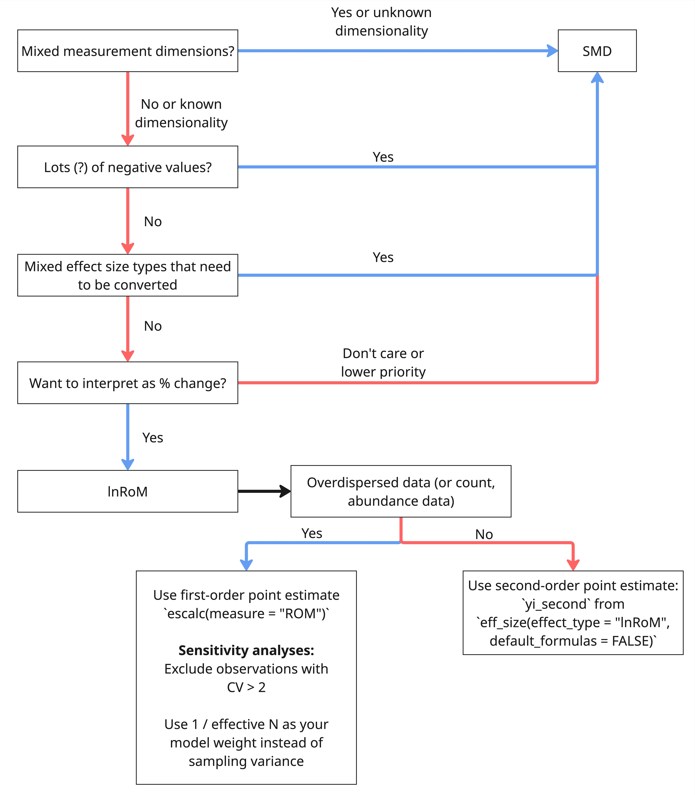

```{r}
#| eval: true
#| echo: false
#| out-width: "70%"

rm(list = ls())
library("metaDigitise")
library("ggplot2")
library("data.table")
library("ggpattern")
library("patchwork")
library("metafor")
library("dplyr")
library("broom")
library("broom.mixed")
library("simplermarkdown")
library("crayon")

# Source our custom functions:
source("scripts/functions/eff_size.R")

```

Effect sizes are not trivial things. They are, in and themselves, small statistical models with their own numeric assumptions and properties. Understanding these assumptions is essential if you want to conduct an accurate and robust meta-analysis and if you want to correctly interpret these effect sizes and the outputs of meta-analytic models.

We here discuss effect sizes for describing continuous outcomes between two discrete groups, such as presented by many experiments. The two dominant effect sizes in this category are Standardized Mean Differences (SMD) and the log-transformed ratio of means (lnRoM). Note that many refer to lnRoM as lnRR (the log response ratio). However, lnRR is also the abbreviation for the log risk ratio, which we also discuss in our section about [binary](2.2-lnOR-assumptions.qmd) outcome effect sizes.

This is among the most common class of effect sizes, especially in ecology and evolution. These effect sizes compare the mean±error of a continuous predictor measured for two groups, such as an experiment and control group. 

These effect sizes require the following statistics: 

- means for the treatment and control groups (henceforth $m_1$ and $m_2$)

- standard deviation for the two groups ($sd_1$, $sd_2$)

- sample size for each group ($n_1$, $n_2$).

::: callout-warning
######### Measurements of error/variance {#sec-callout-error-types}

The effect sizes in this section require standard deviation ($sd$) for the treatment and control groups. $sd$ is fundamentally distinct from standard error ($se$). Some meta-analyses have mistaken the two, with egregious results. Be sure to convert all measurements of error to $sd$. Other commonly reported forms of error include 95% confidence intervals (or 90%), variance, and interquartile ranges (e.g., in boxplots). The extraction package `metaDigitise()` automatically converts $se$, interquartile ranges, and 95% CIs to $sd$.

Just to remind you, here are the relationships between these measurements of error:

$$\begin{aligned}
&sd = se * \sqrt{n}\\
&sd = sqrt(Var)\\
&sd = \frac{CI_{upper} - CI_{lower}}{2*1.96} * \sqrt{n}
\end{aligned}$${#eq-1}
:::


**Recently started revamping this section because I learned new things and it's still a mess. This shit is fucking confusing**

# Background

While we want to keep this tutorial light on equations, we'll briefly give some historic background on the development and math of these effect sizes, which influence the differences in the table above. We'll only look at the point estimator formulas here.

SMD, also known as Hedges' g, is the bias-corrected version of Cohen's d. With $sd$, $m$, and $n$ the standard deviation, mean, and sample size of the extracted data for groups 1 and 2, Cohen's d is defined as:

$$\begin{aligned}
&d = \frac{m1-m2}{sd_{pooled}} \\
\end{aligned}$${#eq-2}

$sd_{pooled}$ is:

$$
\begin{aligned}
sd_{pooled} = \sqrt{\frac{sd_1^2 (n_1 - 1) + sd_2^2 (n_2 - 1)}{n_1 + n_2 - 2}}\\
\end{aligned}
$${#eq-3}

Cohen's d can be biased in its estimate of SMD at low sample size. For that reason, @Hedges1981-bt did some fancy math to create a small-sample size bias correction ($J$), which approaches 0 as total $n$ increases. This formulation is known as Hedges' g and is the primary estimator of SMD.

$$\begin{aligned}
&J = 1-\frac{3}{4*(n_1 + n_2 - 2) - 1}\\
&d = \frac{m1-m2}{sd_{pooled}}\\
&g = J * d
\end{aligned}$${#eq-4}

The main take away from these formulas is that the point estimate (both $d$ and $g$) are influenced by standard deviation. Observations with high standard deviation (e.g., that are overdispersed) will have a lower overall point estimate. 

Because this can reduce power in your model and create issues with overdispersed data, @Hedges1999-al later proposed the log-transformed ratio of means, the most widely used effect size in ecology (@REF to Nakagawa/Yefeng). This does not have standard deviation in the point estimate:

$$\begin{aligned}
&lnRoM = log(\frac{m1}{m2}) \\
\end{aligned}$${#eq-5}

The lnRoM point estimate---though not the sampling variance---are more robust to overdispersion, yet by only using the definition formula (the formula used by `escalc` and shown here), the results can be biased by low sample size. For that reason, @Lajeunesse2015-gw also created a 2nd-order bias-corrected version of lnRoM using the Delta method. This calculation is available in our `eff_size` function (under the name `yi_second` and `vi_second`, if you run the function with `default_formulas = FALSE`).

```{r}
#| eval: true
#| echo: true
#| out-width: "70%"

eff_size(effect_type = "lnRoM",
         x1 = 15, x2 = 10,
         sd1 = 2, sd2 = 2,
         n1 = 10, n2 = 10,
         default_formulas = FALSE)
```

Whereas `escalc` returns just the first order point estimate:
```{r}
escalc(measure = "ROM",
       m1i = 15, m2i = 10,
         sd1i = 2, sd2i = 2,
         n1i = 10, n2i = 10)
```


# Should I use SMD or lnRoM? {#sec-smd-or-lnrom}

Choosing whether to use SMD or lnRoM is not simple. If it was all about interpretation, then SMD would be dead. Yet SMD and lnRoM have different numeric properties that constrain your choices. We summarize these in the table below. Don't stress about understanding all of these topics yet, we'll go through each one and can hopefully provide practical guidance on choosing the appropriate effect size for your meta-analysis.

|                                                                       | SMD      | lnRoM |
|-----------------------------------------------------------------------|----------|-------|
| [**Accepts values ≤ 0**](#sec-zeros)                                  | yes      | no    |
| [**Robust to overdispersion**](#sec-overdispersion)                   | no       | 1st-order point estimate is but variance is not? |
| [**Robust to heteroscedasticity**](#sec-heteroscedasticity)           | SMDH     | 1st-order point estimate is but variance is not? |
| [**Robust to dimensionality**](#sec-dimensionality)                   | somewhat | no    |
| [**Can handle missing error bars**](#sec-callout-missing-error-bars)  | no       | yes?  |

It is likely that there is no perfect solution and that you should be prepared to analyze your dataset both with SMD and lnRoM. If your results are qualitatively similar (i.e., in terms of significance and directionality of model estimates), then you can put one of the effect sizes into the supplement. Note that @@Yang2024-fw recommended including **both** lnRoM and SMD in a bivariate meta-analytic model, which can improve model estimates. See their tutorial [here](https://yefeng0920.github.io/BRMA_tutorial_git/)

Given that lnRoM can be converted to readily understandable descriptions of [percent change](#sec-interpretation), we think that lnRoM is likely the preferred effect size for most use cases. 

## Interpretation {#sec-interpretation}

Imagine we calculated an effect size from this sentence:

"Control groups had a mean of 7 (sd=1.2, n=15) while experimental groups had a mean of 12 (sd=0.9, n=15)"

Sometimes life as a meta-analyzer is that sweet and nice, you can just plunk those numbers directly into your dataset and calculate either SMD or lnRoM. Here is SMD:

```{r}
#| eval: true
#| echo: true
#| out-width: "70%"

escalc(m1i = 7, sd1i = 1.2, n1i = 15,
       m2i = 9, sd2i = 0.9, n2i = 15,
       measure = "SMD")

```

However, SMD values are difficult to interpret. They ultimately mean the number of standard deviations between each group. But we generally use the following rules of thumb to interpret them:

- $SMD > |0.8| \approx$ strong effect 

- $SMD > |0.5| \approx$ moderate effect 

- $SMD > |0.2| \approx$ small effect.

In the case above, an SMD of -1.83 can be considered a **strongly negative** effect.

:::callout-important
##### Common Language Effect Size
An alternative to the SMD interpretation values above is to convert SMD to the "Common Language Effect Size" (CLES) [@McGraw1992-ae]. This can be discussed in terms of the chance that a **randomly picked item from group 1 will have a higher value than a randomly picked item from group 2.**

*Is it possible to convert model estimates of SMD to CLES? If not, then let's delete this section*

To calculate CLES from the SMD value of -1.8346 (from above):

*I think Hedges' g needs to be converted to Cohen's d first though...Which is tricky or impossible when this is a model estimate. Maybe doable though?*
```{r}
#| echo: true
#| eval: true

pnorm(-1.8346 / sqrt(2))

```
If our original SMD value pertained to individuals as the unit of replication, we could then write: "We found a 9.7% chance that a person in group 2 (`m2i`) was higher than any randomly individual in group 1."

This can be a useful, albeit a bit linguistically challenging, way to interpret SMD values. 
:::

All of these methods for SMD are a bit clunky. One of the biggest advantages of lnRoM is that it (and the overall meta-analytic model estimates) can be easily converted to % change. Let's calculate lnRoM with the same summary statistics:

```{r}
#| echo: true
#| eval: true
escalc(m1i = 7, sd1i = 1.2, n1i = 15,
       m2i = 9, sd2i = 0.9, n2i = 15,
       measure = "ROM")

```

This can be converted to percent change with $y_i$ as the effect size point estimate:

$$(e^{y_i} - 1) * 100$${eq-6}

In `R`:

```{r}
#| echo: true
#| eval: true

(exp(-0.2513) - 1) * 100

```

Therefore an lnRoM of -0.2513 is equivalent to a -22.6% decrease as a result of the treatment. Being able to convert lnRoM to % change is one of the reasons this effect size is so powerful. However, as we described [above](#sec-smd-or-lnrom), you have to be careful with your assumptions.

## Values ≤ 0
A key consideration in choosing between SMD and lnRoM is whether your dataset has means ≤ 0. These may occur for a variety of reasons, including because of robust [before-after-control-impact](3.2-smd-challenges.qmd#sec-BACI) experimental designs. If means ≤ 0 are common in your dataset then you may have to use SMD to calculate effect sizes for these data.

:::callout-important
#### Data bounded between 0 and 1 {#sec-zero-one-bounded}

Means±SD bounded between 0 and 1 are challenged by their numeric properties: variance tends to retreat to zero when the mean approaches 0 or 1 [@Macartney2022-ik].

To resolve this for SMD and lnRoM effect sizes, you need to transform both the means and the standard deviations, using an arcsin-square root transformation on the mean and an equation derived using the delta method to standardize the standard deviation (see @Macartney2022-ik). 

We cover this transformation in our extraction challenges page [here](3.2-smd-challenges.qmd#sec-proportion-data-with-error) 
:::

## Dimensionality {#sec-dimensionality}

The effect sizes in this section are standardized, which allow us to compare results across studies even if their units were different. However, what if one study measured a response in meters but another study measured it in area ($meter^2$) and a third study measured the same response in volume ($meter^3$)? 

Imagine vegetation studies or morphological measurements of an organism or the size of a tumor. Depending on the effect size you choose, the results can be strongly affected by these added dimensions---which is an overlooked problem in meta-analysis.

For lnRoM, this is a very serious problem---the estimated effect at dimension 1 will double at dimension two!

For this reason, we suggest that if you are committed to using an lnRoM effect size, that you must record the number of dimensions of each measurement. You can use these to divide the resulting effect size point estimate by the number of dimensions to standardize dimensionality. E.g., if the measurement was across 2 dimensions ($m^2$) then divide by 2 and if across 3 dimensions ($m^3$), divide by 3. 

However, there may be many cases where the number of dimensions of the measurement may be unclear. In this case, you must use SMD. We demonstrate this in the hidden code block below.

<details>
<summary>Click to see a demonstration of dimensionality</summary>
Let us demonstrate. We'll create a starting dataset at one dimension and then we'll increase the dimensions from 1 to 2 and 3, by recreating the underlying distribution, recalculating our summary statistics, and calculating SMD or lnRoM effect sizes:

```{r}

# Simulate data for two groups
sim1 <- rnorm(n = 1e8, mean = 15, sd = .6)
sim2 <- rnorm(n = 1e8, mean = 13, sd = .7)

# First dimension:
dim1.1 <- sim1
dim1.2 <- sim2

# Second dimension simulated data for groups 1 and 2
dim2.1 <- sim1^2
dim2.2 <- sim2^2

# Third dimension simulated data for groups 1 and 2
dim3.1 <- sim1^3
dim3.2 <- sim2^3

# Create a data.table of the summary statistics:
dat <- data.frame(m1 = c(mean(dim1.1), mean(dim2.1), mean(dim3.1)),
                  m2 = c(mean(dim1.2), mean(dim2.2), mean(dim3.2)),
                  sd1 = c(sd(dim1.1), sd(dim2.1), sd(dim3.1)),
                  sd2 = c(sd(dim1.2), sd(dim2.2), sd(dim3.2)),
                  n1 = 50,
                  n2 = 50,
                  dimensions = c(1, 2, 3))

dat <- escalc(measure = "ROM",
              m1i = m1, m2i = m2,
              sd1i = sd1, sd2i = sd2,
              n1i = n1, n2i = n2,
              data = dat,
              var.names = c("yi_rom", "vi_rom"))

dat <- escalc(measure = "SMD",
              m1i = m1, m2i = m2,
              sd1i = sd1, sd2i = sd2,
              n1i = n1, n2i = n2,
              data = dat,
              var.names = c("yi_smd", "vi_smd")) |> 
  setDT()
# dat

dat <- eff_size(effect_type = "Z_mean",
         x1 = m1, x2 = m2,
         sd1 = sd1, sd2 = sd2,
         n1 = n1, n2 = n2,
         verbose = FALSE,
         paired = FALSE,
         data = dat)
setnames(dat, c("yi", "vi"), c("yi_Zmu", "vi_Zmu"))

# Convert ROM to % change:
dat <- dat %>%
  mutate(percent_change = (exp(yi_rom) - 1) * 100)
#
p1 <- ggplot(data = dat, 
       aes(x = dimensions, y = yi_rom))+
  geom_path()+
  geom_point(size = 4)+
  ylab("lnRoM point estimate")+
  scale_x_continuous(breaks = c(1, 2, 3))+
  theme_bw()+
  theme(panel.grid = element_blank(),
        legend.position = "none")

p2 <- ggplot(data = dat, 
       aes(x = dimensions, y = percent_change))+
  geom_path()+
  geom_point(size = 4)+
  ylab("Estimated % change")+
  scale_x_continuous(breaks = c(1, 2, 3))+
  theme_bw()+
  theme(panel.grid = element_blank(),
        legend.position = "none")

p1 / p2

```

As you can see, the lnRoM effect size doubled and then tripled as the dimensions increased. In ecology and evolutionary biology, which commonly pool measurements at different dimensions, this is obviously a huge problem!

Now let's look at SMD. Since the y axis values are not comparable, we'll plot the raw SMD as well as the difference of each dimension to the first dimension, to indicate how large of an effect dimensionality had on the strength of the SMD estimate in reference to our [rules of thumb](#sec-interpretation)

```{r}
#| eval: true
#| echo: false
#| out-width: "70%"

setDT(dat)

#' [I forget how to do this in dplyr...]
dat[, smd_diff := (.SD[dimensions == 1]$yi_smd - yi_smd)/.SD[dimensions == 1]$yi_smd * 100]

p1 <- ggplot(data = dat, aes(x = dimensions, y = yi_smd))+
  geom_path()+
  geom_point(size = 4)+
  ylab("Effect size point estimate (yi)")+
  scale_x_continuous(breaks = c(1, 2, 3))+
  theme_bw()+
    theme(panel.grid = element_blank())

p2 <- ggplot(data = dat, aes(x = dimensions, y = smd_diff))+
  geom_path()+
  geom_point(size = 4)+
  ylab("% change in SMD estimate")+
  coord_cartesian(ylim = c(-2, 2))+
  scale_x_continuous(breaks = c(1, 2, 3))+
  theme_bw()+
    theme(panel.grid = element_blank())
p1 / p2

```

SMD is still somewhat affected by the change in dimensions but to a far lesser extent.

</details>
:::callout-important
The dimensionality problem of lnRoM is quite perilous given that lnRoM is the dominant effect size used in ecology and evolution. It may be that the majority of ecological meta-analyses need to be redone.
:::

## Overdispersion {#sec-overdispersion}

SMD and lnRoM assume that the underlying data generation process is normal. This assumption can be broken if the data is overdispersed---which is remarkably common in ecology and evolution, especially with abundance or count data. This can lead to biased point and sampling variance estimates.

There are as yet no effect sizes formulated for overdispersed data. As such, if there is overdispersed data in your dataset, you should:

- Exclude effect sizes that are overdispersed based on rules of thumb we'll give below as a sensitivity analysis in comparison to your full dataset

- Use the inverse of effective sample size as your meta-analytic weight, instead of sampling variance, as an additional sensitivity analysis.

As you'll see throughout this tutorial, sensitivity tests are the annoying reality of meta-analysis.

Testing for overdispersion should be part of your analytic [workflow](3.0-starting-extraction.qmd). The easiest way to test for overdispersion is to calculate the coefficient of variation ($CV$) for your control and treatment groups. $CV$ is the ratio of standard deviation to the mean ($sd/x$).

We consider a $CV>2$ to be indicative of overdispersion. However, for lnRoM, @Lajeunesse2015-gw suggested a small sample-size corrected threshold based on the standardized mean, derived from the Geary test [@Geary1930-yf, @Hedges1999-al]. Let $m$ be the group mean, $sd$ be the standard deviation and $n$ be your group sample size:

**Reading Lajeunesse it looks like this was proposed for SMD too, prior to development of lnRoM**

$$
\begin{aligned}
G' = \frac{m}{sd}*\frac{4*n^{3/2}}{1+4*n}
\end{aligned}
$${#eq-7}

There are several suggested thresholds for this value that can be used to exclude potentially overdispersed and problematic data. Lajuennesse suggested excluding values ≥3. 

If a lot of your data is overdispersed, we recommend using the first-order point estimate of lnRoM (returned by default from `escalc`). We also recommend conducting sensitivity analyses, excluding overdispersed data based on both a $CV>2$ and $G'\geq3$. If a significant portion of your dataset is overdispersed, we also recommend conducting sensitivity analyses that compare model estimates produced with sampling variance as your model weight and effective sample size as your model weight.

<details>
<summary>Click to see a demonstration of overdispersion</summary>

Let's do this in `R` with a $CV>2$ threshold and the Geary-Lajuennesse threshold of 3, using a dataset provided by the `metafor` package:

```{r}
#| eval: true
#| echo: true

data("dat.gibson2002")
dat <- dat.gibson2002

# Drop NA values for the SMD type effect sizes
dat <- dat %>% filter(!is.na(m1i))

# Calculate coefficient of variation:
dat <- dat %>%
  mutate(cv1 = sd1i / m1i,
         cv2 = sd2i / m2i)

n_overdispersed <- dat %>% 
  filter(cv1 > 2 | cv2 > 2) %>%
  nrow()
n_overdispersed/nrow(dat) * 100

```

It looks like 46% of this dataset has a $CV>2$!

```{r}
#| eval: true
#| echo: true

# With the Geary-Lajuennesse threshold:
geary <- function(sd, m, n){
  (m/sd) * (4*n^(3/2))/(1 + 4*n)
}

dat <- dat %>%
  mutate(gl1 = geary(sd = sd1i, m = m1i, n = n1i),
         gl2 = geary(sd = sd2i, m = m2i, n = n2i))


n_overdispersed <- dat %>% 
  filter(gl1 > 3 | gl2 > 3) %>%
  nrow()
n_overdispersed/nrow(dat) * 100

```

It looks like \~54% the data in this meta-analysis fails the Geary-Lajuennesse test. So what do you do if that happens? We suggest that you filter out overdispersed values and rerun your models, both with the full dataset and with the subsets that are not overdispersed.

An alternative approach is to use the inverse of effective sample size as your meta-analytic model weight, instead of sampling variance. This may be an essential method when a significant amount of your data is overdispersed. This is a method that produces reasonable meta-analytic estimates, despite ignoring standard deviation [@Nakagawa2023-tn].

Effective sample size is defined as: 
$$
\begin{aligned}
N_{0} = \frac{4n_1n_2}{n_1 + n_2}\\
\end{aligned}
$${#eq-8}

Let's go through a full example, with lnRoM as our effect size.

First we'll calculate lnRoM point estimates and sampling variance:

```{r}
#| eval: true
#| echo: true

dat <- escalc(measure = "ROM", 
              m1i = m1i, m2i = m2i, 
              sd1i = sd1i, sd2i = sd2i,
              n1i = n1i, n2i = n2i,
              data = dat, append = TRUE) |> 
  setDT()
head(dat)

```

Now let's run an intercept only model with `vi` as our meta-analytic weight (taken by the argument `V`). Note that there is only one effect size per article, which is reflected in our random effect formula (which lacks an effect size ID nested within the article id `author`):

```{r}
#| eval: true
#| echo: true

m1 <- rma.mv(yi, 
             V = vi,
             random = ~ 1 | author,
             data = dat)
```

Now, let's run a model excluding the overdispersed data:

```{r}
# Now let's run a sensitivity analysis by excluding overdispersed data
sub.dat <- dat %>% 
  filter(cv1 <= 2 & cv2 <= 2)
m2 <- rma.mv(yi, 
             V = vi,
             random = ~ 1 | author,
             data = sub.dat)
```

Finally, let's run a model using the inverse of effective sample size as our weight.

```{r}
dat <- dat %>%
  mutate(effective_N = (4*n1i*n2i)/(n1i+n2i))

m3 <- rma.mv(yi, 
             V = 1/effective_N,
             random = ~ 1 | author,
             data = dat)
```

Let's compare these:

```{r}
#| eval: true
#| echo: false

compare_estimates <- rbind(m1 %>% 
                             tidy() %>% 
                             mutate(model = "all data",
                                    ci.lb = m1$ci.lb,
                                    ci.ub = m1$ci.ub),
                           m2 %>%
                             tidy() %>%
                             mutate(model = "CV <= 2",
                                    ci.lb = m3$ci.lb,
                                    ci.ub = m3$ci.ub),
                           m3 %>%
                             tidy() %>%
                             mutate(model = "1/effective_N",
                                    ci.lb = m3$ci.lb,
                                    ci.ub = m3$ci.ub))
compare_estimates$model <- factor(compare_estimates$model,
                                  levels = c("all data", "CV <= 2", "1/effective_N"))

ggplot(data = compare_estimates,
       aes(x = model, y = estimate, ymin = ci.lb, ymax = ci.ub))+
  ylab("Estimate ± 95% CIs")+
  geom_hline(yintercept = 0)+
  geom_pointrange()+
  theme_bw()

```

It looks like the sensitivity analyses (CV ≤ 2 and 1/effective_N) both produced similar results which were more conservative than when the entire dataset was analyzed.

</details>

## Heteroscedasticity {#sec-heteroscedasticity}

Heteroscedasticity (i.e., differences in variance between the experimental groups) can bias effect sizes considerably. SMD has a special formulation that accounts for heteroscedasticity [@Bonett2009-sf]. This is available as the measure 'SMDH' in `metafor::escalc`.

**Does heteroscedasticity matter for lnRoM sampling variance or 2nd-order point estimate????**

Are there rules of thumb for heteroscedasticity? Ratio of CV1 to CV2? What threshold?

```{r}
# Demonstrate in R...

```


# Conclusion---which effect size to use?

As you can see, choosing between lnRoM and SMD is complex. The flow chart below summarizes our advice for choosing between these effect sizes. Note that one consideration we did not discuss above is whether you need to convert between different effect size types. SMD is the universal solvent of effect size conversions. If your dataset requires a considerable number of conversions, then SMD is your guy. See [here](4-converting-effect-sizes.qmd) where we discuss this in further detail.



However, we also recommend doing analyses with both SMD and lnRoM, as argued by @Yang2024-fw (**there might be a better ref for this**), who also showed that including both SMD and lnRoM in a bivariate model can improve model estimates. See their tutorial [here](https://yefeng0920.github.io/BRMA_tutorial_git/).

Note that if you decide to use lnRoM, then you should be prepared to use the 2nd-order point estimator if your data is normally distributed (i.e., isn't overdispersed)---this is to account for bias at low sample sizes. This is returned by `eff_size` as `yi_second`. 

However, if your data is *overdispersed* (or consists of count data or abundance data) then you should use the 1st-order point estimator returned by `escalc` by default or by `eff_size` as `yi_first`.

```{r}
#| eval: true
#| echo: true
#| out-width: "70%"

eff_size(effect_type = "lnRoM",
         x1 = 15, x2 = 10,
         sd1 = 1.5, sd2 = 1.5,
         n1 = 15, n2 = 15,
         default_formulas = FALSE)

```

Finally, if your data fails the Geary-Lajeunesse test described [above](#sec-overdispersion) or has $CV>2$, we recommend running models that excluding overdispersed data and with the inverse of effective N as your model weights [@Nakagawa2023-tn].

:::callout-important
#### Missing error bars

Note that some extraction challenges may also influence your choice of effect size. For example, it is possible to calculate lnRoM for data that did not report error (e.g., standard deviation, standard error, etc) by imputing error with cross-study coefficient of variation [@Nakagawa2023-tn]. This is a good reason to use lnRoM but has to be weighed against the other numeric assumptions described above. We discuss this further [here](3.2-smd-challenges.qmd#sec-callout-missing-error-bars).

:::

# Alternative estimators {#sec-alternative-estimators}

## Paired designs {#sec-paired-designs}

Alternative variance estimators for SMD and lnRoM can account for *paired* designs, that is for correlated variance between groups 1 and 2. Effect sizes derived from paired designs can be compared directly to those from unpaired designs, as long as you're using the same effect size (e.g., within the SMD or lnRoM family).

In paired design estimators, the variance estimation formulas accept an additional argument $r$-the correlation between plots or individuals. Since $r$ is usually unknown and unreported, it's general practice to set it to 0.5 or 0.8 and to run sensitivity analyses to ensure that that choice isn't unduly influencing your model estimates.

::: callout-note
######### $rho$ {#sec-specifying-rho}

The correlation between groups, $rho$ (`ri` in `escalc`) is rarely reported and so needs to be assigned based, basically, on guesswork. We'd suggest that if the pairing is within an individual or plot (e.g., before-after a treatment), then a $rho$ of 0.8 seems reasonable. However, if the pairing is based on spatially paired but independent plots (e.g., adjacent to each other) then a rho of 0.5 would be more reasonable.

Be sure to always conduct sensitivity analyses on these choices, to ensure that they aren't unduly changing your model estimates.
:::

If group 1 and 2 are paired (e.g., in a before-after design), you can calculate a paired lnRoM with the following code. Note that you only supply a single value for sample size (`ni`) instead of `n1i` and `n2i` because a paired design must by definition have equal sample sizes in each treatment. Paired lnRoMs will have the same point estimate (yi) as their unpaired flavor but will have lower variance and thus higher weight in your meta-analytic models.

```{r}
#| echo: true
#| eval: false

# First, unpaired:
unpaired <- escalc(m1i = 7, sd1i = 1.2, 
                    m2i = 12, sd2i = 0.9,
                    n1i = 15, n2i = 15,
                    measure = "ROM",
                    var.names = c("yi_unpaired", "vi_unpaired"))


# Now, the paired version:
paired <- escalc(m1i = 7, sd1i = 1.2, 
        m2i = 12, sd2i = 0.9,
        ni = 15, ri = 0.8,
        measure = "ROMC",
        var.names = c("yi_paired", "vi_paired"))

cbind(unpaired, paired)

```

As you can see, the point estimate remained the same but the variance was reduced in the paired formulation, leading to a stronger influence in the meta-analytic models.

For SMD, there is also a paired version that is comparable to non-paired values (e.g., you can include both in the same analysis). However, to the best of our knowledge, these are not available in `escalc`.

There are several other options available in `escalc` to account for paired designs with SMD-type data. However, these are not comparable to standard unpaired SMD measures. And for that reason should only be used if the entire meta-analysis is of the same design. See the [cheatsheet](6-escalc-cheatsheet.qmd) where we attempt to clear up these (in)compatibilities. 

For that reason, you need to use our function `eff_size`. `eff_size` has a paired formulation of SMD that only influences the sampling variance and can thus be compared with unpaired SMD estimates, like those returned by `escalc`. NEED A REF TO THIS, I GUESS THE SAFE MS?


```{r}
#| echo: true
#| eval: false

unpaired <- eff_size(x1 = 7, sd1 = 1.2, 
                      x2 = 12, sd2 = 0.9, 
                      n1 = 15, n2 = 15,
                      paired = FALSE,
                      verbose = FALSE,
                      effect_type = "SMD")
setnames(unpaired, c("yi", "vi"), c("yi_unpaired", "vi_unpaired"))

paired <- eff_size(x1 = 7, sd1 = 1.2, 
                    x2 = 12, sd2 = 0.9, 
                    n = 15, r = 0.5,
                    paired = TRUE,
                    verbose = FALSE,
                    effect_type = "SMD")
setnames(paired, c("yi", "vi"), c("yi_paired", "vi_paired"))

cbind(unpaired, paired)

```

As you can see, the paired version reduced the sampling variance but not the point estimate. The formula for paired SMD point estimates and sampling variance is here:

$$
\begin{aligned}
&J = 1 - \frac{3}{4 * (2n - 2) - 1} \\
&sd_{pooled} = \sqrt{\frac{sd_1^2(n-1) + sd_2^2(n-1)}{2n - 2}} \\
&d = \frac{m_1 - m_2}{sd_{pooled}} \\
&g = J * d \\
&Var(g) = \frac{2 * (1-r)}{n} + \frac{d^2}{2 * (n-1)} \\
\end{aligned}
$${#eq-9}
