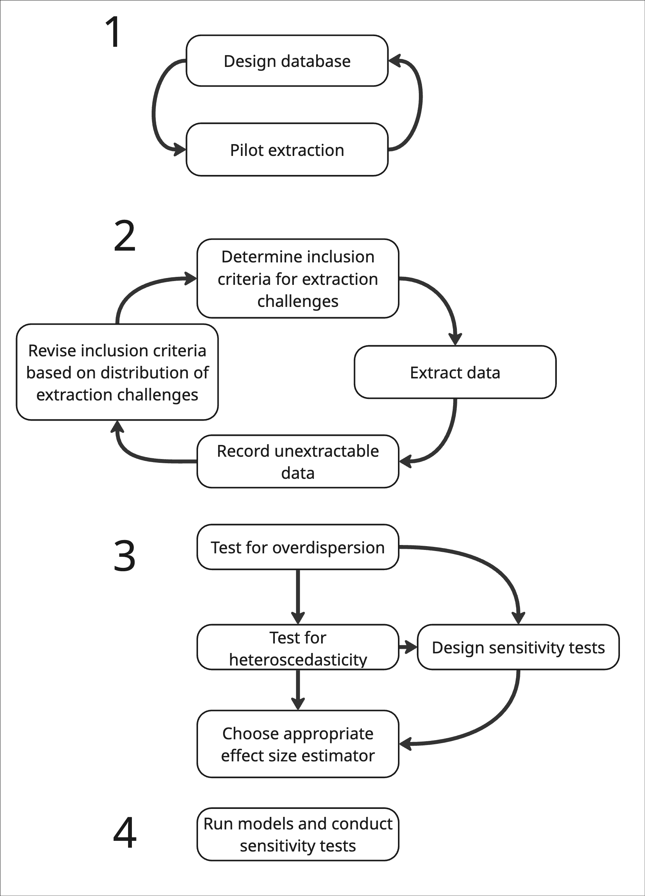

There are many steps to conducting a high quality meta-analysis. The rest of this tutorial is designed to help with extracting data and calculating effect size  and . 

Data extraction is one of the most difficult steps and will make an important difference in whether you are able to accurately extract all of the data pertaining to your question and correctly calculate your effect size. Extraction errors and calculation errors are common and can severely bias meta-analytic results [@Gotzsche2007-rb].

However, the other steps to conducting a meta-analysis are also critical. Here are some of our favorite tutorials and papers, that start with the inception of a meta-analytic project (question formation, scoping, literature search and screening) and proceed through every step of the process.

| Step                          | Reference                   |
|-------------------------------|-----------------------------|
| Formulating a question        | @Foo2021-yp                 |
| Literature search & screening | @Lagisz2025-yq; @Foo2021-yp |
| Database design               | XXX                         |
| Extraction                    | Yours truly                 |
| Random effects                | XXX                         |
| Spatial and phylogenetic non-independence | @Mizuno2026-ab  |
| Modeling                      | XXX                         |
| Publication bias              | @Nakagawa2022-ei            |
| Reporting guidelines          | @Page2021-qn; @O-Dea2021-pl |

Also check this: https://royalsocietypublishing.org/rsta/article/384/2321/20240604/481953/A-preliminary-data-analysis-workflow-for-meta

# Data extraction planning {#sec-extraction-planning}

The first step to doing the data collection for a meta-analysis is to have a solid and clear question, a screened body of literature, and clear decision trees for what data to extract. We recommend doing pilot extractions (of \~10%) of your screened literature to estimate the total number of anticipated effect sizes. 

Moreover, we recommend recording the distribution of *extraction challenges* during this stage. By extraction challenges, we mean data that is presented in formats that are difficult to extract---the challenges that this tutorial will help you tackle.

Some extraction challenges, while solvable, introduce assumptions or potential error. If these extraction challenges (such as model estimates) are a minimal portion of a very large dataset, then you can justifiably decide not to extract them. 

However, if these difficult cases are common, if there are relatively few papers, or if you believe these types of data are *non-randomly* distributed in your dataset (e.g., often occur in papers from certain geographic regions, time periods, etc), then you may want to decide *a priori* to extract them.

This can be done after initial extraction as well, if you took record of the effect sizes that were excluded because they were unextractable (and why). For example, if only 5% of your dataset comes from African countries and 50% of that data was not extractable, we think it would be justifiable to expand your extraction criteria to other data types.

Finally, following extraction, you'll want to evaluate the statistical distributions of your data to understand whether the effect size estimator you plan to use is appropriate. We discuss these assumptions in previous sections.

{width="40%"}


**Should change "Test for overdispersion" -> "Test numeric assumptions (e.g., overdispersion)"**

:::callout-note
#### Organizing sensitivity analyses
You'll see a common refrain throughout this tutorial---sensitivity analyses! 

These can be extremely cumbersome---requiring you to run many many models. Typing each model out by hand or copy-and-pasting is prone to error and challenges in interpretation.

We recommend creating a "model guide" and evaluating text strings in your model objects in a `for` loop or `foreach` loop to facilitate thorough sensitivity analyses. The `R` call `eval(parse(text = string))` can evaluate the text string `string` as R code, and allows you to tidily organize your model formulas (or even the entire model call), as well your as your conditional strings to filter your dataset inside a data frame in `R`. 

For an example of the `R` code for such a workflow, see a recent example [here](https://ejlundgren.github.io/cat_evidence_review/3.2-run-models.html)
:::

## Types of extraction
There are three main types of extraction you'll face in doing a meta-analysis. First, the extraction of **summary statistics**, like means, standard deviations and sample sizes. These can be reported in figures, tables, or in the text. 

Second, you may find studies that publish their **raw data**. These can often be difficult to summarize because of unclear metadata but are still a valuable and important source of data for the meta-analyst. Note that these data can also be valuable in cases where the authors report summary statistics across a range of dependent and non-independent data. Summarizing the raw data directly can help you produce effect sizes with clear and coherent non-independence structures and similar  as the rest of your dataset.

Third, you will find many studies that report **inferential statistics**---such as test statistics, p-values, and so on. Some of these can be converted to effect sizes directly. Others are lost forever: sadly, model estimates derived from mixed effect models cannot be used in meta-analysis.

## Tools for extracting data from figures {#sec-tools-for-extraction}

If you're lucky, some of the data extraction for a meta-analysis can come directly from summary statistics (mean, sample size, standard deviation, etc) reported in tables or the main text of the papers you're extracting. However, you'll find that the majority of data extraction will be directly from figures. In these cases, you'll employ a variety of tools to calibrate the figures and extract the data

We do not here discuss the mechanics of these tools but we will describe them and their advantages, briefly, here.

| Extraction tool | Environment | log-axes | Auto-conversion | Free-form extraction | Built-in reproducibility |
|------------|------------|------------|------------|------------|------------|
| `metaDigitise()` | R | Yes | SE/IQR/CIs $\rightarrow$ SD | No | Yes |
| `WebPlotDigitizer` | Web/Desktop | Yes | No | Yes | No |
| `ImageJ` | Desktop | No | No | Yes | No |

An analysis [@Gotzsche2007-rb] found that data extraction errors were prolific in meta-analysis, leading to considerable bias. For that reason, we highly recommend that researchers use transparent workflows for data extraction [@Ivimey-Cook2023-vo]. This includes saving screenshots of figures, preferably along with extraction points [which is automatically done by `metaDigitise()` [@Pick2018-ia]] in folders that link directly to the final dataset.

We also note that many large language models, such as NotebookLM, Gemini, chatGPT, Claude, are capable of extracting data from figures---potentially with high accuracy. However, utilizing these tools still requires that researchers maintain reproducible and transparent workflows and understand *what* data to extract.

## Experimental methods {#sec-experimental-methods}

Some of the techniques we present here, especially for [reconstructing underlying data](7-simulating-non-gaussian-responses.qmd) from author provided summaries are little known and could be regarded as experimental. 

We nonetheless present these approaches as they are, in our mind, better than the alternative, especially in meta-analyses with limited numbers of studies. 

We tag experimental approaches throughout and invite further research on the relative bias and efficacy of these techniques. And as, always, be sensitive and conduct sensitivity analyses!

## Database design

Many of the authors here conducted their first meta-analysis gallavantly, extracting data, thinking little about the complex non-independence structures in their source data, or collecting data long in a fashion that made future summaries extremely difficult. We learned our lessons---going back through 400 studies multiple times to fix a 10,000 row meta-analytic dataset is no fun.

We here present an excel template that could be useful. It contains a tab for each of the effect size categories included here, along with metadata descriptions. Many of these columns may not make sense yet---hopefully by the time you've finished reading this tutorial, they will.

```{r}
#| echo: false

library("downloadthis")

download_file(path = "data/template_dataset.xlsx",
                output_name = "database_template",
                output_extension = ".xlsx",
                button_label = "Download template dataset",
                button_type = "primary", # Controls styling 
                has_icon = TRUE,
                icon = "fa fa-save")


```

<br>
Many of the columns in this are a non-exhaustive suggestion for drivers of non-independence *within* articles. Some of these are discussed in the next page on [universal extraction challenges](3.1-universal-challenges.qmd).

The other columns are effect size specific, which we also discuss in each effect size specific page.


