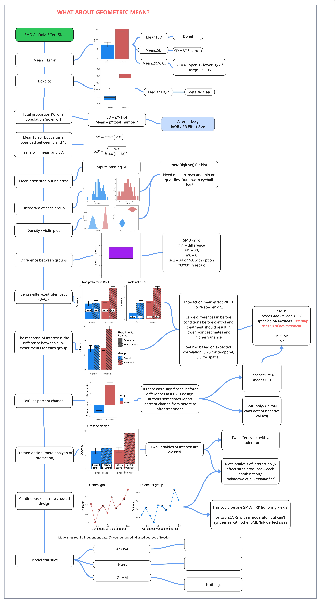

```{r}
#| eval: true
#| echo: false
#| out-width: "70%"

rm(list = ls())
library("metaDigitise")
library("ggplot2")
library("data.table")
library("ggpattern")
library("patchwork")
library("metafor")
library("dplyr")
library("broom")
library("broom.mixed")
library("simplermarkdown")
library("crayon")

# Source our custom functions:
source("scripts/functions/eff_size.R")
source("scripts/functions/convert_effect_sizes.R")

```

These are among the most commonly used effect size types in meta-analyses. These effect sizes compare a continuous response variable between two discrete categorical predictors (e.g., Control vs Experiment). By continuous, we mean a measurement summarized by its central tendency (mean, median) and dispersion (variance, standard deviation, standard error) across replicates. These replicates are the sample size.

The primary effect sizes that can be calculated with this data are standardized mean difference (SMD), log-transformed ratio of means (lnRoM), and Zmu. Please see @sec for a more thorough description of these effect sizes, their assumptions, and their interpretation. In general, the extraction for these effect sizes is similar, though, as you will see, some data types constrain you to only using SMD because of values ≤ 0, which only SMD can handle.

# Extraction

<!-- Cheatsheet: **Rough version** **Make it downloadable/printable**  -->

<!-- {width=60%} -->

## The simple cases

We'll start with the simplest figure types, mostly in order to contrast with more complex types. If you're using `metaDigitise()` to extract data, the function will guide you through calibrating the axes and selecting the top of the error bars and the top of the bars themselves (the mean). If the figure reports standard error ($se$), metaDigitise() will convert it automatically to standard deviation ($sd$). Always be aware of what the error type is.

```{r}
#| echo: false
#| eval: true
#| out-width: "70%"

m1 <- rnorm(n = 50, mean = 7, sd = 1.2)
m2 <- rnorm(n = 50, mean = 12, sd = .9)

# Simple:
dt <- data.frame(mean = c(mean(m1), mean(m2)), sd = c(sd(m1), sd(m2)),
                 group = c("Control", "Treatment"))
# dt <- 
ggplot(data = dt,
       aes(x = group, y = mean, fill = group))+
  geom_col()+
  geom_errorbar(aes(ymin = mean-sd, ymax = mean+sd),
                width = .5)+
  scale_fill_manual(NULL,
                    values = c("Control" = "dodgerblue2",
                               "Treatment" = "indianred"))+  
  xlab(NULL)+
  ylab("Outcome")+
  theme_bw()+
  theme(panel.grid = element_blank(),
        legend.position = "none")

```

Box plots are also straightforward and involve extracting the minimum, lower quartile, median, upper quartile, and maximum values. `metaDigitise()` will walk you through that extraction and will automatically convert the interquartile range and median to mean±SD.

```{r}
#| echo: false
#| eval: true
#| out-width: "70%"

dt <- data.frame(group = c(rep("Control", length(m1)),
                           rep("Treatment", length(m2))),
                 Outcome = c(m1, m2))

ggplot(data = dt,
       aes(x = group, y = Outcome, fill = group))+
  geom_boxplot()+
  scale_fill_manual(NULL,
                    values = c("Control" = "dodgerblue2",
                               "Treatment" = "indianred"))+  
  xlab(NULL)+
  ylab("Outcome")+
  theme_bw()+
  theme(panel.grid = element_blank(),
        legend.position = "none")

```

It's also common to see figures like this with more complex non-independence structures. These can be dealt with by digitizing only the final time point or by controlling for non-independence with random effects (see tutorial in @sec).

```{r}
#| echo: false
#| eval: true
#| out-width: "70%"


# Simple:
dt <- data.frame(mean = c(10, 12, 12.5, 
                          14, 14.5, 16), 
                 sd = c(1.5, 1.2, 1.3,
                        2.1, 1.8, 1.9),
                 group = c("Control", "Control", "Control",
                           "Treatment", "Treatment", "Treatment"),
                 Time = c(1, 2, 3,
                          1, 2, 3))
# dt <- 
ggplot(data = dt,
       aes(x = Time, y = mean, fill = group))+
  geom_col(position = position_dodge(width = 1))+
  geom_errorbar(aes(ymin = mean-sd, ymax = mean+sd),
                position = position_dodge(width = 1),
                width = .5)+
  scale_fill_manual(NULL,
                    values = c("Control" = "dodgerblue2",
                               "Treatment" = "indianred"))+  
  xlab("Time point")+
  ylab("Outcome")+
  theme_bw()+
  theme(panel.grid = element_blank(),
        legend.position = "none")

```

Let's move on to more complex situations.

## Histograms

It's also common to see the outcome variable of the two discrete predictor groups plotted as separate histograms:

```{r}
#| echo: false
#| eval: true
#| out-width: "70%"

hist1 <- ggplot()+
  geom_histogram(aes(x = m1), bins = 20,
                 fill = "dodgerblue2", alpha = .75)+
  theme_bw()+
  xlab("Outcome")+
  ylab("Count")+
  theme(panel.grid = element_blank())

hist2 <- ggplot()+
  geom_histogram(aes(x = m2), bins = 20,
                 fill = "indianred", alpha = .75)+
  theme_bw()+
  xlab("Outcome")+
  ylab("Count")+
  theme(panel.grid = element_blank())

hist1 + hist2

```

`metaDigitise()` luckily has built-in functionality for dealing with histograms. The function will guide you through each step, which requires calibrating the axes and then clicking on the left and right corners of each bar. It'll then convert the extracted distributions into means±sd.

## 3-dimensional plots
There was a brief period in the 1990s when these became popular. 3-d plots were often of histograms. but many other types existed. **WHAT SOFTWARE FOR 3-d PLOTS??** 

We won't discuss these much here, we just want to acknowledge your pain if you have come across one. Hopefully the general plot designs will be similar to those covered in this tutorial.

## Violin and density plots

The beauty of modern plotting techniques has led to a proliferation of new ways to visualize data. Like violin plots.

```{r}
#| echo: false
#| eval: true
#| out-width: "70%"

violin.dt <- data.table(response = c(m1, m2),
                        type = c(rep("group 1", length(m1)),
                                 rep("group 2", length(m2))))

violin <- ggplot()+
  geom_violin(data = violin.dt, 
              aes(x = type, y = response, fill = type))+
  theme_bw()+
  scale_fill_manual(NULL,
                    values = c("group 1" = "dodgerblue2",
                               "group 2" = "indianred"),
                    labels = c("group 1" = "Control",
                               "group 2" = "Treatment"))+  
  xlab(NULL)+
  scale_x_discrete(labels = c("group 1" = "Control",
                               "group 2" = "Treatment"))+  
  ylab("Outcome")+
  theme(panel.grid = element_blank(),
        legend.position = "none")
violin

```

Violin plots are basically a vertical version of a density plot:

```{r}
#| echo: false
#| eval: true
#| out-width: "70%"

dens <- ggplot()+
  geom_density(data = violin.dt, 
              aes(x = response, fill = type), 
              color = "transparent")+
  theme_bw()+
  scale_fill_manual(NULL,
                    values = c("group 1" = "dodgerblue2",
                               "group 2" = "indianred"),
                    labels = c("group 1" = "Control",
                               "group 2" = "Treatment"))+  
  xlab("Outcome")+
  scale_x_discrete(labels = c("group 1" = "Control",
                              "group 2" = "Treatment"))+  
  ylab("Density")+
  theme(panel.grid = element_blank(),
        legend.position = "none")
dens

```

**Eye-ball it?** Use a different extraction tool to extract the entire distribution? Then...?

## Proportion data (0-1) bounded without error

Sometimes SMD/lnRoM design types will present the total % of a population for a study design that is otherwise indistinguishable from other SMD/lnRoM/Zmu studies in your dataset. For example, instead of recording mean mortality ± SD across survey plots, a study may present total proportion mortality across study plots. If they also reported the total number of individuals monitored, then this would preferably be an lnOR/lnRR effect size.

See @sec where we talk about a potentially better way to deal with this data by converting it back to discrete response data, which, if most of your dataset is lnOR is probably the best way.

Luckily, mean±SD can be extracted from a proportions with the following formulas, where $p$ is the proportion, $m$ is the mean, $sd$ is standard deviation, and $total$ is the population size??.

*I THINK?* 


$$\begin{aligned}
&sd = p * (1-p) \\
&m = p*total?? \\
\end{aligned}$$

## Proportion data (0-1) bounded with error

Means±SD bounded between 0 and 1, however, are also challenged by XYZ numeric properties that lead to XYZ.

To resolve this, you need to transform both the means and the standard deviations, where $m$ is the group mean and $sd$ is its standard deviation:

$$\begin{aligned}
&m' = arcsin(\sqrt{m})\\
&sd' = \sqrt{\frac{sd^2}{4m(1-m)}}\\
\end{aligned}$$

In R:

```{r}
#| echo: true
#| eval: true

m = 0.7
sd = 0.1

m_trans <- asin(m)
sd_trans <- sqrt(sd^2 / (4*m * (1-m)))

c("transformed_mean" = m_trans, "transformed_sd" = sd_trans)
```

And then calculate your effect sizes as normal with the transformed values ($m'$ and $sd'$).

## Differences

Some studies have paired designs where, instead of reporting each pair separately, they subtract the paired samples from each other and report mean±error of the **difference**.

```{r}
#| echo: false
#| eval: true
#| out-width: "70%"

diff <- m1 - m2

ggplot()+
  geom_boxplot(aes(y = diff, x = "Difference"),
               fill = "#9BC53D")+
  ylab("Control - Treatment")+
  xlab(NULL)+
  theme_bw()+
  theme(panel.grid = element_blank(),
        axis.text.x = element_blank())

```

To deal with this data, we'll extract the boxplot with `metaDigitise()`, which will convert the median±interquartile range to mean±SD. We will then consider the control group to have a mean of 0. However, you have only one measurement of error. For this reason, you'll have to pretend that the control error is the same as the treatment error.

| Treatment mean | Treatment SD | Control mean | Control SD |
|----------------|--------------|--------------|------------|
| -8.11          | 1.27         | 0            | 1.27       |

Note that since lnRoM cannot accept negative values or 0s, you have no choice but to use SMD for this type of data. If the difference was *positive*, you could use lnRoM, after adding a small constant to the mean of the control group. 

Also, given that this is *paired* data, you should use a paired formulation of SMD or lnRoM. Note that you have to specify $r$ (`ri` in `escalc`) for this. We recommend using the values of 0.5 or 0.8 and conducting sensitivity tests with both options.


```{r}
#| eval: false
#| echo: true

# r = 0.8
eff_size(x1 = -8.11, sd1 = 1.27, 
        x2 = 0, sd2 = 1.27, 
        n = 15, r = 0.8,
        paired = TRUE,
        verbose = FALSE,
        effect_type = "SMD")

# r = 0.5
eff_size(x1 = -8.11, sd1 = 1.27, 
        x2 = 0, sd2 = 1.27, 
        n = 15, r = 0.5,
        paired = TRUE,
        verbose = FALSE,
        effect_type = "SMD")

```


## Ratios of control and treatment groups

Some studies report the ratio of the control group to the treatment group, instead of subtracting the samples from each other and reporting the mean±error of the difference. 

In other words, they report the response ratio (which might be logged or unlogged).

Whether you can extract this data depends on whether they report the mean±error of paired response ratios (e.g., calculated for each paired sample) or if they report a single value response ratio calculated from the group means. To try to spell that out:

This is usable. In this case, a vector of response ratios ($rr_i$) was calculated from each paired sample ($y_{i,treatment}$, $y_{i,control}$) and then summarized by the mean ($m$) and standard deviation ($sd$):

$$
rr_i = \frac{y_{i,treatment}}{y_{i,control}}}
m = \frac{\Sigma{rr_i}{n}
sd = \sqrt{Var(rr_i)}
$$
In this case, you can extract the $m$ and $sd$ and use these directly to calculate an lnRoM effect size (after logging it, if it wasn't originally logged). The reported standard deviation can be converted to sampling variance (e.g., $var = sd^2$). 

**IS this correct?**

However, if the authors took group means across each treatment ($m_{control}$, $m_{treatment}$) and then reported the response ratio of these means ($rr$), what do you do? 

$$
\begin{aligned}
&m_{treaatment} = \frac{\Sigma{y_{i, treatment}}}{n} \\
&m_{control} = \frac{\Sigma{y_{i, control}}}{n} \\
&rr = \frac{m_{treatment}}{m_{control}} \\
\end{aligned}
$$
The error has essentially been discarded and we don't see any way that this data can be recovered.

**????**

## Before-after-control-impact designs

Before-after control-impact (BACI) designs are gold standard experimental designs. Yet most meta-analyses ignore the before treatment and only extract and analyze the 'after' treatments. Here is a BACI figure:


```{r}
#| echo: false
#| eval: true
#| out-width: "70%"

bc <- rnorm(n = 50, mean = 7, sd = 1.2)
bi <- rnorm(n = 50, mean = 8.2, sd = .9)

ac <- rnorm(n = 50, mean = 7.3, sd = 1)
ai <- rnorm(n = 50, mean = 13.8, sd = .8)

baci <- data.table(m_bc = mean(bc),
                   sd_bc = sd(bc),
                   m_bi = mean(bi),
                   sd_bi = sd(bi),
                   m_ac = mean(ac),
                   sd_ac = sd(ac),
                   m_ai = mean(ai),
                   sd_ai = sd(ai))
baci$id <- "blah"
baci <- melt(baci,
             id.vars = "id")
baci[, c("type", "trt") := tstrsplit(variable, "_")]
baci <- dcast(baci,
              trt + id ~ type, value.var = "value")
# baci

baci[, before_after := ifelse(grepl("b", trt), "before", "after")]
baci[, control_impact := ifelse(grepl("c", trt), "control", "impact")]
baci$before_after <- factor(baci$before_after, levels = c("before", "after"))
# baci

ggplot()+
  geom_col_pattern(data = baci, 
                   aes(x = control_impact, y = m, fill = control_impact,
                       pattern = before_after),
           position = position_dodge(.9))+
  geom_errorbar(data = baci, aes(ymin = m-sd, ymax = m+sd, 
                                 x = control_impact,
                                 group = before_after),
                position = position_dodge(.9),
                width = .5)+
  geom_label(data = baci, aes(x = control_impact, y = 4,
                             label = before_after,
                             group = before_after),
             position = position_dodge(.9),
             size = 3)+
  xlab(NULL)+
  ylab("Outcome")+
  ggtitle("Non-problematic BACI")+
  scale_pattern_manual("Before/after treatment", values = c("before" = "none",
                                                             "after" = "stripe"))+
  scale_fill_manual(values = c("control" = "dodgerblue2",
                               "impact" = "indianred"),
                    labels = c("control" = "Control",
                               "impact" = "Treatment"))+
  scale_x_discrete(labels = c("control" = "Control",
                              "impact" = "Treatment"))+
  theme_bw()+
  theme(panel.grid = element_blank(),
        legend.position = "none")

```

In this case, only extracting and analyzing the 'after' data isn't a big deal, because the differences in the 'before' groups in the control and treatment are minimal.

However, what about a more problematic result, where there's a big difference in before conditions between the control and treatment?

```{r}
#| echo: false
#| eval: true
#| out-width: "70%"

baci2 <- copy(baci)
# baci2

baci2[trt == "bc", m := 3]
# baci2[trt == "ac", m := m * 2]
#
ggplot()+
  geom_col_pattern(data = baci2, 
                   aes(x = control_impact, y = m, fill = control_impact,
                       pattern = before_after),
                   position = position_dodge())+
  geom_errorbar(data = baci2, aes(ymin = m-sd, ymax = m+sd, 
                                 x = control_impact,
                                 group = before_after),
                position = position_dodge(1),
                width = .5)+
  geom_label(data = baci, aes(x = control_impact, y = 1,
                              label = before_after,
                              group = before_after),
             position = position_dodge(.9),
             size = 3)+
  xlab(NULL)+
  ylab("Outcome")+
  ggtitle("Problematic BACI")+
  scale_pattern_manual("Before/after treatment", values = c("before" = "none",
                                                            "after" = "stripe"))+
  scale_fill_manual(values = c("control" = "dodgerblue2",
                               "impact" = "indianred"),
                    labels = c("control" = "Control",
                               "impact" = "Treatment"))+
  scale_x_discrete(labels = c("control" = "Control",
                              "impact" = "Treatment"))+
  theme_bw()+
  theme(panel.grid = element_blank(),
        legend.position = "none")
```

What do you do about something like that? Do you just exclude the study?

The best way to deal with this data is to calculate the difference between the means of the before and after groups for each treatment of interest. 

Then use the standard deviation from the *after* treatment group. You could alternatively use the standard deviation from the before group, but we're not sure how to justify this (you might know though). 

Since the treatment groups themselves are not paired, you'd use an unpaired estimator formula. 

Since your values may be negative, you'll most likely have to use SMD.

```{r}
#| echo: true
#| eval: true
# First calculate differences:
dt <- data.table(mean_control_difference = 7.36 - 3.00,
                 mean_treatment_difference = 13.87 - 8.27,
                 sd_control = 1.33,
                 sd_treatment = 0.98)

# Now calculate effect size:
res <- eff_size(x1 = mean_treatment_difference,
       x2 = mean_control_difference,
       sd1 = sd_treatment,
       sd2 = sd_control,
       n1 = 15, n2 = 15,
       data = dt,
       verbose = F,
       effect_type = "SMD",
       paired = FALSE)

knitr::kable(res)

```

Note that these 4 group designs may appear in other contexts than pre and post and can be fairly in common in ecological field experiments. For example, to understand if reintroduced wild dogs affect vegetation by reducing dik-dik browsing and abundance, Ford et al. XXXXX placed controls and exclosures in areas with and without wild dogs, predicting that the *difference* between controls and exclosures would be greatest where there are no wild dogs (REF).

```{r}
#| echo: false
#| eval: true
#| out-width: "70%"
ggplot()+
  geom_col_pattern(data = baci, aes(x = before_after, y = m, 
                                    fill = before_after,
                                    pattern = control_impact,
                                    group = control_impact),
           position = position_dodge())+
  geom_errorbar(data = baci, aes(ymin = m-sd, ymax = m+sd, 
                                 x = before_after,
                                 group = control_impact),
                position = position_dodge(1),
                width = .5)+
  xlab(NULL)+
  ylab("Outcome")+
  scale_pattern_manual(name = "Experimental\ntreatment", values = c("control" = "none",
                                                                    "impact" = "stripe"),
                       labels = c("control" = "Sub-control",
                                  "impact" = "Sub-treatment"))+
  scale_fill_manual("Group", values = c("before" = "dodgerblue2",
                               "after" = "indianred"),
                    labels = c("before" = "Control",
                               "after" = "Treatment"))+
  scale_x_discrete(labels = c("before" = "Control",
                              "after" = "Treatment"))+
  theme_bw()+
  theme(panel.grid = element_blank(),
        legend.position = "right")

```

In this case, you'd do the same as above. As you can see, when dealing with this type of data, lnRoM becomes unusable because of negative values. Instead you have to use SMD.

## % Change

Sometimes BACI type data is presented directly as percent change, which saves us some of the steps above.

```{r}
#| eval: true
#| echo: false

baci.wide <- dcast(baci,
                   control_impact ~ before_after,
                   value.var = c("m", "sd"))
baci.wide[, percent_change := (m_after - m_before) / m_before * 100]

# Customize this:
baci.wide[control_impact == "control", percent_change := -15]
baci.wide[control_impact == "impact", percent_change := 35]
baci.wide[, percent_sd := 5]

ggplot(data = baci.wide, aes(x = control_impact,
                             y = percent_change,
                             fill = control_impact,
                             ymin = percent_change-percent_sd,
                             ymax = percent_change+percent_sd))+
  geom_hline(yintercept = 0)+
  geom_col()+
  geom_errorbar(width = .5)+
  ylab("Percent change from before to after")+
  xlab(NULL)+
  scale_x_discrete(labels = c("control" = "Control",
                              "impact" = "Treatment"))+
  scale_fill_manual("Group", values = c("control" = "dodgerblue2",
                                        "impact" = "indianred"),
                    labels = c("control" = "Control",
                               "impact" = "Treatment"))+
  theme_bw()+
  theme(panel.grid = element_blank(),
        legend.position = "right")
```

## Crossed design (meta-analysis of interaction)

Sometimes you are interested explicitly in interactions between two treatments. In most studies one of the treatments you are interested in would otherwise be a moderator (e.g., not crossed with the main experimental comparison), however in others you find a fully crossed design. What do you do about that?

```{r}
#| echo: false
#| eval: true
#| out-width: "70%"

# Just use the same data as baci:
baci3 <- copy(baci)
baci3[, control_impact := ifelse(control_impact == "control", "Factor 2\ncontrol", "Factor 2\ntreatment")]

ggplot()+
  geom_col_pattern(data = baci3, aes(x = before_after, y = m, 
                                    fill = before_after,
                                    pattern = control_impact,
                                    group = control_impact),
                   position = position_dodge())+
  geom_errorbar(data = baci3, aes(ymin = m-sd, ymax = m+sd, 
                                 x = before_after,
                                 group = control_impact),
                position = position_dodge(1),
                width = .5)+
  geom_label(data = baci3, aes(x = before_after, y = 1,
                               label = control_impact,
                               group = control_impact),
             position = position_dodge(.9),
             size = 3)+
  xlab(NULL)+
  ylab("Outcome")+
  ggtitle("Crossed design")+
  scale_pattern_manual(name = "Experimental\ntreatment", values = c("Factor 2\ncontrol" = "none",
                                                                    "Factor 2\ntreatment" = "stripe"))+
  scale_fill_manual("Group", values = c("before" = "dodgerblue2",
                                        "after" = "indianred"),
                    labels = c("before" = "Factor 1 control",
                               "after" = "Factor 1 treatment"))+
  scale_x_discrete(labels = c("before" = "Factor 1 control",
                              "after" = "Factor 1 treatment"))+
  guides(fill = "none", pattern = "none")+
  theme_bw()+
  theme(panel.grid = element_blank(),
        legend.position = "right")

```

*Out of scope for now* You can either extract one of those treatments as the effect size, and use the other treatment as a moderator in your models, or you can use Shinichi's crazy interaction formulas:

$$\begin{aligned}
&XXXXXX\\
\end{aligned}$$

```{r}
# Demonstrate in R

```

## Continuous x discrete crossed design

Sometimes interactions will be between continuous and discrete variables:

```{r}
#| echo: false
#| eval: true
#| out-width: "70%"

x1 <- seq(1:10)
x2 <- seq(1:10)

y1 <- x1 * 1 + rnorm(n = 10, mean = 0, sd = 1.5)
# plot(x1, y1)

y2 <- 3 * 2 + rnorm(n = 10, mean = 1, sd = .5)
# plot(x1, y2)

dt <- data.table(x1 = x1, x2 = x2, y1 = y1, y2 = y2)

p1 <- ggplot(data = dt, aes(x = x1, y = y1))+
  geom_path(color = "indianred")+
  geom_point(size = 3, fill = "indianred", shape = 21)+
  ggtitle("Control group")+
  ylab("Outcome")+
  xlab("Continuous variable of interest")+
  theme_bw()+
  theme(panel.grid = element_blank(),
        legend.position = "none")
# p1

p2 <- ggplot(data = dt, aes(x = x2, y = y2))+
  geom_path(color = "dodgerblue2")+
  geom_point(size = 3, fill = "dodgerblue2", shape = 21)+
  ggtitle("Treatment group")+
  ylab("Outcome")+
  xlab("Continuous variable of interest")+
  theme_bw()+
  theme(panel.grid = element_blank(),
        legend.position = "none")
# p2

p1 + 
  p2 + 
  plot_layout(ncol = 2)

```

In this case, you could extract each point for the control group and the treatment group and calculate mean±SD. But then you'd lose the 'continuous variable of interest' (which might be a core moderator of interest in your analysis).

Alternatively, you could calculate two Zr (see below @SEC) effect sizes, one for the 'control group' and one for the 'treatment group'. The control group and moderator factor would then be a moderator—if this is how the rest of your dataset is designed.

As you can see, there might be no perfect solution. Care and thought are necessary to make this type of data comparable to other effect sizes in your dataset.

## Time series with a binary predictor

Sometimes the data is presented as a time series with a discrete intervention at one point in the time series, such as the introduction or eradication of a species. For example:

```{r}
#| eval: true
#| echo: false
#| out-width: "70%"

# length(x1)
status <- c(rep("Present", 5),
            rep("Eradicated", 5))
dt <- data.table(x1, y1, status)
dt$group <- 1

ggplot(data = dt, aes(x = x1, y = y1, fill = status, group = group))+
  geom_path()+
  geom_point(size = 3, shape = 21)+
  scale_fill_manual("Group of interest",
                    values = c("Present" = "dodgerblue",
                               "Eradicated"= "indianred"))+
  scale_x_continuous(breaks = 1995:2005)+
  xlab("Year")+
  ylab("Response of interest")+
  theme_bw()+
  theme(panel.grid = element_blank())


```

In the case above, you should extract the response of interest for each group (Present versus Eradicated), calculate mean±SD for each group, and then calculate SMD or lnRoM (or Zmu) with the *paired* estimator. The sample size would be the number of individual points per group.

However, you'll often see cases like this as well, with $<3$ measurements for one of the factor groups (making SMD impossible to calculate):

```{r}
#| eval: true
#| echo: false
#| out-width: "70%"

# length(x1)
status <- c(rep("Present", 8),
            rep("Eradicated", 2))
dt <- data.table(x1, y1, status)
dt$group <- 1

ggplot(data = dt, aes(x = x1, y = y1, fill = status, group = group))+
  geom_path()+
  geom_point(size = 3, shape = 21)+
  scale_fill_manual("Group of interest",
                    values = c("Present" = "dodgerblue",
                               "Eradicated"= "indianred"))+
  scale_x_continuous(breaks = 1995:2005)+
  xlab("Year")+
  ylab("Response of interest")+
  theme_bw()+
  theme(panel.grid = element_blank())


```

In this case, your best bet will be to calculate a Zr effect size with a binary continuous predictor of 0 or 1 (see sec). The resulting effect size could be converted to SMD (see sec).

## Time series with error bars

However, what do you do if each of these measurements has associated error?

```{r}
#| eval: true
#| echo: false
#| out-width: "70%"

dt$error <- rnorm(mean = .5, sd = .2, n = nrow(dt))

ggplot(data = dt, aes(x = x1, y = y1, fill = status, group = group))+
  geom_path()+
  geom_point(size = 3, shape = 21)+
  geom_errorbar(aes(ymin = y1 - error, ymax = y1 + error))+
  scale_fill_manual("Group of interest",
                    values = c("Present" = "dodgerblue",
                               "Eradicated"= "indianred"))+
  scale_x_continuous(breaks = 1995:2005)+
  xlab("Year")+
  ylab("Response of interest (mean±SD)")+
  theme_bw()+
  theme(panel.grid = element_blank())


```

If the sample size associated with each point is known (e.g., reported in text), then you can *draw* the underlying data based on sample size, group mean, and standard deviation extracted from the figure. This should use the underlying data generating process of the response. If the response is normally distributed, or close enough, then you can use the R base function `rnorm`. This will produce a longer dataset, with a row for every estimated sample. You'd then calculate the group mean, standard deviation, and total sample size for the binary predictor of interest, in this case "Eradicated" versus "Present". You could also do a similar process to calculate Zr, if a correlation includes error bars (see @sec).

::: callout-tip
If the author-provided data presents standard error (or confidence intervals, etc) instead of standard deviation (which is common), then you *must* convert these to standard deviation before attempting to reconstruct the underlying distribution based on author-provided sample size per point.
:::

To walk you through this, imagine you've extracted the means and standard deviation for each point in the figure above. Each point represents a survey. The authors reported in the text that each survey had a sample size (based on number of plots) of 10. You could produce a table like this:

```{r}
#| eval: true
#| echo: false
#| out-width: "50%"

setnames(dt, c("y1", "error"), c("mean", "sd"), skip_absent = TRUE)
dt[, N := 10]

knitr::kable(dt[, .(mean, sd, N, status)])

```

Each row of this dataset is a summary of an internal dataset, which we can reconstruct by drawing from the appropriate statistical distribution. In this case, we are going to assume that the data is normally distributed. See @sec for how to draw data for other distributions (e.g., negative binomial). The object `dt` is our table of extracted means, standard deviations, and author-provided sample sizes. To keep the code readable, we'll do this in a for loop, saving each drawn dataset to an element of our list object `dt_expanded`:

```{r}
#| eval: true
#| echo: true
#| out-width: "70%"

dt_expanded <- list()

nrow(dt)
# 10 rows in raw dataset

for(i in 1:nrow(dt)){
  dt_expanded[[i]] <- data.table(y = rnorm(mean = dt$mean[i],
                                          sd = dt$sd[i],
                                          n = dt$N[i]),
                                status = dt$status[i])
}

dt_expanded <- rbindlist(dt_expanded)

nrow(dt_expanded)
```

We have now reconstructed the 'original' data across all time points, creating a 100 row dataset. We can now summarize the mean and standard deviation of the reconstructed data by our treatment group (Present vs Eradicated).

```{r}
#| eval: true
#| echo: true
#| out-width: "70%"
#| 
# Now summarize:
final_dt <- dt_expanded[, .(mean = mean(y),
                            sd = sd(y),
                            total_n = .N),
                        by = .(status)]

knitr::kable(final_dt)
```

Voila, a dataset that constructs group means that are comparable, with an accurate sample size and pooled standard deviation. If the underlying data generating process is not normal (which is likely the case for ecological data, especially abundance data), then you probably want to use a negative binomial distribution to generate data. See @sec X in the Appendix for a guide.

Unfortunately, if the sample size for each of the points in the above figure is unknown, then your best option if the number of groups is $≥3$, is to ignore the standard deviation and calculate a new mean from each point for the two SMD comparison groups. Or, if the number of groups is $<3$, to calculate Zr from just the group means per point (ignoring the standard deviation).

## Results reported as an effect size itself

One quite common situation is for studies to report their results as log-transformed ratio of means (lnRoM, also lnRR), as we discussed above, or SMD. These could be extracted directly as your effect size *except* that in our experience these studies rarely report a measure of dispersion (sampling variance, or SD or SE which could be converted to variance).

If a measurement of error is provided, then you can extract the data as is, and convert that error to sampling variance. For example, if SMD ± standard error was plotted, the sampling variance is $$vi = SE^2$$.

If a study reports standardized mean differences (e.g., Cohen's d), which is uncorrected estimator of SMD, you can use `escalc` to convert it to `Hedges' g`, the dominant estimator of SMD by specifying Cohen's d as the `di` argument:

```{r}
escalc(measure = "SMD",
       di = 5, 
       n1i = 10, n2i = 10)
```

In many other cases, there's nothing you can do but email the authors and hope they have their raw data.

## Missing error bars

**If someone was willing to summarize Nakagawa's lab papers on interpolating missing error bars....**

for lnRoM, use average cross-study CV: https://onlinelibrary.wiley.com/doi/10.1111/ele.14144

## Geometric mean

We have seen some studies that report *geometric* means instead of normal algorithmic means.

*According to Gemini*, you can convert the geometric mean ($m_{geo}$) and geometric standard deviation ($sd_{geo}$) to the algorithmic (e.g., normal) mean ($m_a$) and normal standard deviation ($sd_a$) with the following equation, which assumes a log-normal distribution:

**I think gemini might have made some mistakes**

$$
\begin{aligned}
&Var_{ln} = log(sd_{geo})^2 \\
&m_a = m_{geo} * e^{\frac{Var_{ln}}{2}} \\
&sd_a = m_a * \sqrt{e^{Var_{ln}} - 1} \\
\end{aligned}
$$
In R:

```{r}
#| eval: true
#| echo: true
sd_g <- 2.5
m_g <- 31

var_ln <- log(sd_g)^2
m_a <- m_g * exp(var_ln/2)
sd_a <- m_a * sqrt(exp(var_ln) - 1)

c("final_mean" = m_a, "final_sd" = sd_a)
```

**That sd is extremely high...**

## When the predictor isn't really binary

The cases we've been discussing concern a binary predictor. E.g., an experiment and a control group. However, this can sometimes be a farce. For example, imagine you're meta-analyzing the effect of red foxes on the abundance of their prey. Many studies present results that look like the figures we've been seeing that compare an area with high fox abundance to an area with low fox abundance due to an eradication or culling treatment. However, the 'low' fox treatment still has foxes, just a lower density, while the 'high' fox treatment also has foxes.

You have two options with data like this. One option is to use an SMD-type effect size but treat the difference in density as a moderator in your models. This can lead to complex models, especially if you have several other moderators and require an interaction of each to density. A

The other option is to calculate correlation coefficients for this data (Zr). Correlation coefficients require at least 4 observations, which can be simulated if the associated data has mean±error (see @sec). Regardless, these decisions are non-trivial and should be carefully documented. Furthermore, see @sec for discussion of how formulating custom effect sizes can help account for nuisance heterogeneity.

## Model estimates

There is often a tension in publishing primary data between presenting statistical summaries that are usable for a meta-analyst (e.g., means, standard deviation, sample size) and presenting statistical summaries that are robust to non-independence. You will note as a meta-analyst that many studies present model estimates, often derived from mixed-effect models, instead of raw summary statistics. Unfortunately, mixed-effect model estimates are not usable in meta-analysis.

Other articles will present test statistics and p-values from simple linear models (e.g., not mixed effect models). These are usable by the meta-analyst, with some core assumptions.

**CAN WE CALCULATE Zmu OR lnRoM from model estimates?**

| Model type         | Usable | Effect size | Statistics required |
|--------------------|--------|-------------|---------------------|
| GLMM               | No     | none        |                     |
| t test             | Yes    | SMD         |                     |
| paired t test      | Yes    | SMD         |                     |
| 1-way ANOVA        | Yes?   | ?           |                     |
| 2-way ANOVA        | Yes?   | ?           |                     |
| linear model       | Yes    | ?           |                     |
| mixed effect model | No     | N/A         | N/A                 |

t and z are useful, as they include directionality (with a negative or positive sign). F, p-values, chi-square are difficult to use because they lack directionality (so have to figure it out from text or figures). Unfortunately, many articles simply write non-directional statements like "There was no relationship between predictor and response ($\chi^2$=0.5, p=0.7)". In these situations, the data is unusable because there's no suggestion of directionality.

**Can you calculate lnRoM or Zmu with statistics? **

### From the t statistic

Calculating SMD from test statistics depends on whether the data come from a paired design (in which case df = n-1) or an independent two-sample design (df = n_1 + n_2 - 2). This is the formula for calculating SMD from a unpaired, two-sample design t test statistic:

$$
\begin{aligned}
&d=t*\sqrt{\frac{1}{n_1} + \frac{1}{n_2}} \\
&J= 1 - \frac{3}{4(n_1 + n_2 - 2) - 1} \\
&g=J*d \\
&Var(g) = \frac{n_1 + n_2}{n_1 n_2} + \frac{g^2}{2(n_1 + n_2 - 2)} \\
\end{aligned}
$$
In `escalc` you simply specify the t statistic (with `ti`), as well as sample sizes for each group (`n1`, `n2`) and use measure "SMD", which will return the unpaired SMD estimate.

```{r}
t = -1.5
n1 = 15
n2 = 15

escalc(measure = "SMD",
       ti = t,
       n1i = n1,
       n2i = n2)

```

For a paired design (e.g., paired t test):

$$
\begin{aligned}
&d=\frac{t}{\sqrt{n}} \\
&J= 1 - \frac{3}{4(n - 1) - 1} \\
&g=J*d\\
&Var(g) = \frac{1}{n} + \frac{g^2}{2(n - 1)} \\
\end{aligned}
$$

We do not know the measure for an SMD paired formula (that is still comparable to the unpaired SMD).

```{r}

# escalc(measure = "SMD",
#        ti = t,
#        n1i = n1,
#        n2i = n2)

```

### From p values:

To calculate SMD from p values, in `escalc`, one needs to assign the sign (e.g., + or -) to the p-value (or do this to the `yi` point estimate afterwards). Note that these p-values needed to be from two-sided tests.

```{r}
p = -0.07
n1 = 15
n2 = 15

escalc(measure = "SMD",
       pi = p,
       n1i = n1,
       n2i = n2)
```

### From F statistic

??? I don't see this as an option in escalc

# NOTES / To read

https://besjournals.onlinelibrary.wiley.com/doi/10.1111/2041-210X.12927
