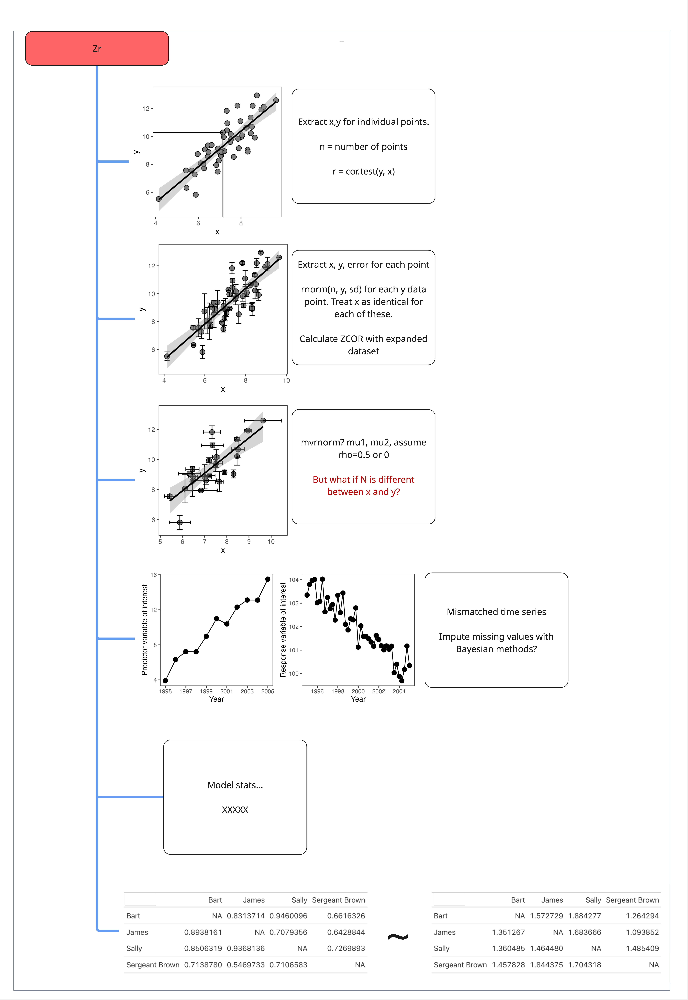

```{r}
#| eval: true
#| echo: false
#| out-width: "70%"

rm(list = ls())
library("metaDigitise")
library("ggplot2")
library("gt")
library("lubridate")
library("data.table")
library("ggpattern")
library("patchwork")
library("metafor")
library("dplyr")
library("broom")
library("broom.mixed")
library("simplermarkdown")
library("crayon")

# Source our custom functions:
source("scripts/functions/eff_size.R")
source("scripts/functions/convert_effect_sizes.R")

```

# Everything's a spectrum, man {#sec-introduction}

Zr describes the correlation between two continuous variables and is thus an important effect size in the meta-analyst tool kit. Zr type data often takes the form of a scatterplot but other formats exist (e.g., matrices, time series, and model estimates). We'll go through these examples in turn, along with solutions and limitations for extracting Zr type data.

In general, Zr effect size extractions often require a long-format raw database, where each row is one of the points in the corresponding scatterplot. This dataset is then summarized in R to derive $r$ (the correlation coefficient from `cor.test`) and sample size ($n$) and a single row per unique correlation. Be sure to have clear ID columns to help with summarization. Alternatively, you can calculate $r$ and $n$ whiel extracting data but this may lead to clunkiness in your workflow.

**Demonstrate this here?**

<!-- {width=60%} -->

## Simple figures {#sec-simple-figures}

This is the simplest type of correlation figure. In this case, you'd calibrate the x and y axes and extract each point. Then use `cor.test` in R to calculate the correlation coefficient:

```{r}
#| echo: false
#| eval: true
#| out-width: "70%"

x <- rnorm(n = 50, mean = 7, sd = 1.2)
y <- x * 1.3 + rnorm(n = 50, mean = 0, sd = 1)

dat <- data.table(x = x, y = y, sd = abs(rnorm(n = 50, mean = 0, sd = .5)),
                  n = 10)

ggplot(data = dat, aes(x = x, y = y))+
  geom_smooth(method = "lm", color = "black")+
  geom_point(size = 3, shape = 21, fill = "grey50")+
  xlab("x")+
  ylab("y")+
  theme_bw()+
  theme(panel.grid = element_blank(),
        legend.position = "none")

```

Then calculate the Zr effect size in escalc:

```{r}
#| echo: true
#| eval: true

n = length(x)
out <- cor.test(x, y)
out$estimate

escalc(measure = "ZCOR",
       ri = out$estimate, ni = n)

```

## Overplotting {#sec-overplotting}

What if there is an ugly cluster of overlapping points?

```{r}
#| echo: false
#| eval: true
#| out-width: "70%"

x <- rnorm(n = 50, mean = 7, sd = 1.2)
y <- x * 1.3 + rnorm(n = 50, mean = 0, sd = 1)

dat <- data.table(x = x, y = y, sd = abs(rnorm(n = 50, mean = 0, sd = .5)),
                  n = 10)
dat.sub <- dat[rep(5, 12), ]
dat.sub$x <- jitter(dat.sub$x, amount = .05)
dat.sub$y <- jitter(dat.sub$y, amount = .05)

ggplot(data = dat, aes(x = x, y = y))+
  geom_smooth(method = "lm", color = "black")+
  geom_point(size = 3, shape = 21, fill = "grey50")+
  geom_point(data = dat.sub, aes(x = x, y = y), fill = "hotpink",
             shape = 21, size = 3)+
  xlab("x")+
  ylab("y")+
  theme_bw()+
  theme(panel.grid = element_blank(),
        legend.position = "none")

```

In these cases, if the total number of points is reported for the study, you can duplicate the values of the red points as many times as it takes to match the total sample size. Otherwise, you'll just have to digitize as many as you can and use a sample size that may be less than the real sample size (which makes the overall Zr estimate more conservative—e.g., less weight in the model). For example, in the figure above, we could safely eyeball 5 separate points (though in reality there are 12).

# Error bars {#sec-error-bars}
## Single axis error bars {#sec-single-axis-error-bars}

But what do you do if each point is actually a mean±SD?

```{r}
#| echo: false
#| eval: true
#| out-width: "70%"

ggplot(data = dat, aes(x = x, y = y))+
  geom_point(size = 3, shape = 21, fill = "grey50")+
  geom_errorbar(width = .25, aes(ymin = y-sd, ymax = y+sd))+
  geom_smooth(method = "lm", color = "black")+
  xlab("x")+
  ylab("y")+
  theme_bw()+
  theme(panel.grid = element_blank(),
        legend.position = "none")

```

If the error bars are only on the y axis this is fairly straightforward but is a bit surprising. In this case, each point actually has an internal-N, which will need to be gleaned from the methods of the paper. After determining this internal-N, extract the means and SDs for each point, and then draw a distribution of internal-N for each point with an appropriate distribution. Here we'll demonstrate using `rnorm` to draw normally distributed data for each point.

::: callout-warning
If the author-provided data presents standard error (or confidence intervals, etc) instead of standard deviation (which is common), remember that you absolutely *must* convert these to standard deviation before attempting to reconstruct the underlying distribution. See [here](2.1-SMD-assumptions.qmd#sec-callout-error-types) on how to convert from other measures of error to standard deviation.
:::

```{r}
#| echo: true
#| eval: true

head(dat)

y_expanded <- list()

for(i in 1:nrow(dat)){
  y_expanded[[i]] <- data.table(y = rnorm(mean = dat$y[i],
                                          sd = dat$sd[i],
                                          n = dat$n[i]),
                                x = dat$x[i])
}
y_expanded <- rbindlist(y_expanded)

head(y_expanded)

```

In this example data, each point had an internal N of 10 measurements. Notice that the original dataset went from 50 rows (individual points) to 500 rows ($50 * 10$). We then take this expanded dataset and calculate our correlation coefficient and effect size:

```{r}
# Now calculate 'r':
out <- cor.test(x, y, data = y_expanded)
n <- nrow(y_expanded)

escalc(measure = "ZCOR",
       ri = out$estimate,
       ni = n)
```

Pretty neat, right?

However, in this example (and the one below) doing this assumes that the internal measurements of each point are at least somewhat independent—at least as independent as the sample N for other studies in your meta-analysis. If the internal measurements of these points are far less independent than in other studies in your meta-analysis then you may want to calculate the correlation just on the point means, and ignore the standard deviation. These decisions require a degree of thoughtfulness and good documentation to ensure consistency, especially when extracting data from a diversity of (messy) ecological studies.

## x and y axis error bars {#sec-x-and-y-axis-error-bars}

What do you do if there are also error bars on the x axis? For example, if each point is a mean±SD of two different measurements. This is common in field studies, where researchers may sample vegetation at a site and some other factor (e.g., animal activity or soil nutrients) and then present the means±SD of each site in a correlation.

```{r}
#| echo: false
#| eval: true
#| out-width: "70%"

dat[, x_sd := abs(rnorm(50, mean = 0, sd = .25))]
setnames(dat, "n", "y_n")
setnames(dat, "sd", "y_sd")

dat[, x_n := 20]

ggplot(data = dat[sample(25)], aes(x = x, y = y))+
  geom_point(size = 3, shape = 21, fill = "grey50")+
  geom_errorbar(width = .25, aes(ymin = y-y_sd, ymax = y+y_sd))+
  geom_errorbarh(aes(xmin = x-x_sd, xmax = x+x_sd), height = .25)+
  geom_smooth(method = "lm", color = "black")+
  xlab("x")+
  ylab("y")+
  theme_bw()+
  theme(panel.grid = element_blank(),
        legend.position = "none")
```

In this case, you'll do approximately the same thing. Except that you need to choose a single internal-N (for the rows of the expanded x and y variables to align). The most conservative choice would be the N with the lowest sample size between the x and the y variable. In the table below, you'll see the extracted mean values for the x and y variables (`x`, `y`), their standard deviations (`x_sd`, `y_sd`), and their internal sample sizes (`x_n` and `y_n`), which differ. We'll first, choose the small sample size and then we'll draw simulated data.

```{r}
#| echo: true
#| eval: true
head(dat)

# Choose the n with the lowest sample size:
dat[, n := min(c(x_n, y_n))]

xy_expanded <- list()

for(i in 1:nrow(dat)){
  xy_expanded[[i]] <- data.table(y = rnorm(mean = dat$y[i],
                                           sd = dat$y_sd[i],
                                           n = dat$n[i]),
                                 x = rnorm(mean = dat$x[i],
                                           sd = dat$x_sd[i],
                                           n = dat$n[i]))
}
xy_expanded <- rbindlist(xy_expanded)

knitr::kable(head(xy_expanded))
```

Our dataset went from 50 rows (one per point in the figure above) to 500 rows, given an internal N of 10 per point.

Now, we calculate the correlation between all of these points and calculate our 'Zr' effect size:

```{r}
#| echo: true
#| eval: true
# Now calculate 'r':
out <- cor.test(x, y, data = xy_expanded)
n <- nrow(y_expanded)

escalc(measure = "ZCOR",
       ri = out$estimate,
       ni = n)

```


If the variable of interest (the response variable `y`) is not Guassian (e.g., is not normally distributed) but is count (Poisson) or overdispersed count data (negative binomial), etc, then you need to draw the underlying data with the appropriate distribution (e.g., `rpois` or `rnbinom`). Doing so requires converting author-provided summary statistics (e.g., the mean and standard deviation in the figure above) to the distribution-specific parameters. See [here](6-simulating-non-gaussian-responses.qmd) where we demonstrate this.


:::callout-important
######### Summarizing non-independent and independent data {#sec-callout-data-reconstruction}
In several sections through this tutorial we demonstrate or allude to reconstructing underlying data behind author summaries. This can align the *unit of replication* of the resulting effect sizes with the rest of your dataset. 

However, one should be thoughtful and careful about the non-independence structures embedded within these summaries. The resulting effect size will be based on a mixture of more and less independent data. For example, in the correlation plots [above](#sec-single-axis-error-bars), there are two types of non-independence: the measurements across the x-axis locations and the summarized measurements within each x-axis location. 

Reconstructing the underlying data with `rnorm`, as we demonstrated above, and then summarizing by the `mean±sd` of each treatment group mixes these non-independence structures.

For that reason, we suggest that data extracted like this should be tagged and that you should record whether the data was summarized across time, across spatially-independent samples (or different individuals), or across both. These factors may explain methodological heterogeneity in your dataset. Note that similar mixtures of spatially, temporally, or spatiotemporally summarized data are also likely embedded within author-reported means±sds (which we also [recommend](3.1-universal-challenges.qmd#sec-callout-non-independence) recording)
:::


# Time series {#sec-time-series}
## Mismatched time series {#sec-mismatched-time-series}

Sometimes the factors of interest that you want to correlate are in separate graphs as time series. In these cases, it's just the tedious task of extracting data from each and aligning the two variables.

However, what do you do if the time series are mismatched?

Below, we'll plot two time series, one for Variable 1 and one for Variable 2:

```{r}
#| eval: true
#| echo: false
#| out-width: "70%"

library("lubridate")

x1 <- seq(from = 1995, to = 2005, by = 1)
x2 <- seq(from = 1995, to = 2005, by = .25)

y1 <- seq(from = 5, to = 15, by = 1)
y1 <- y1[1:11] 
y1 <- y1 + rnorm(n = 11, mean = 0, sd = .5)
# plot(x1, y1)

#
y2 <- seq(from = 100, to = 110, by = .1)
y2 <- y2[1:length(x2)]
y2 <- y2 + rnorm(n=length(x2), mean = 0, sd = .5)
# plot(x2, y2)

# slopes2 <- rnorm()
dt1 <- data.table(x1 = x1,
                  y1 = y1)
dt2 <- data.table(x2 = x2,
                  y2 = rev(y2))

p1 <- ggplot(data = dt1, aes(x = x1, y = y1))+
  geom_path()+
  geom_point(size = 3)+
  xlab("Year")+
  ylab("Variable 1")+
  theme_bw()+
  scale_x_continuous(breaks = seq(from = min(dt1$x1), to=max(dt1$x1), by = 2),
                     labels = as.integer(seq(from = min(dt1$x1), to=max(dt1$x1), by = 2)))+
  theme(panel.grid = element_blank(),
        legend.position = "none")
# p1

#
dt2[, date := date_decimal(x2) |> as.Date()]
p2 <- ggplot(data = dt2, aes(x = date, y = y2))+
  geom_path()+
  geom_point(size = 3)+
  xlab("Year")+
  ylab("Variable 2")+
  theme_bw()+
  # scale_x_continuous(breaks = seq(from = min(dt1$x1), to=max(dt1$x1), by = 2))+
  theme(panel.grid = element_blank(),
        legend.position = "none")
# p2

p1 + p2

```

What is the best way to line up variable 1 and variable 2 to calculate their correlation? While imputing the missing values in the second panel is one possible approach, it is the least conservative. Instead, we recommend taking the average of the most frequently sampled variable to align with the less frequently sampled variable. Alternatively, you can filter the data (after aligning by the shared x-axis) to just those occassions where there is data for both series. 

Aligning the data like this is tricky and will probably require manual merging based on nearest value in a spreadsheet software (e.g., Excel) after calibrating both the x and y axes. **UGH**

# Discrete responses {#sec-discrete-responses}
## Discrete responses with a continuous predictor {#sec-discrete-responses-binary-predictor}

Imagine you are conducting a meta-analysis concerned with factors driving mortality in some organism. Many of the studies use a discrete predictor, e.g., presence or absence of a predator. These types of data are naturally suited for the [lnOR or lnRR effect sizes](2.2-lnOR-assumptions.qmd). However, other studies report mortality in relationship to the *abundance* of that predator---e.g., the continuous manifestation of presence/absence.

```{r}
#| eval: true
#| echo: false
#| out-width: "70%"

dat <- data.table(living = rbinom(n = 50, p = 0.75, size = 1),
                  temperature = rnorm(n = 50, mean = 18, sd = 5))

ggplot(data = dat, aes(x = temperature, y = living))+
  geom_point(size = 3, alpha = 0.9, shape = 21, fill = "grey50")+
  scale_y_continuous(breaks = c(0, 1), labels = c("Living", "Dead"))+
  theme_bw()+
  theme(panel.grid = element_blank(),
        legend.position = "none")

```

Depending on your meta-analysis question you may very well want to extract this data and calculate a Zr correlation effect size, which can be converted to lnOR (see [here](4-converting-effect-sizes.qmd)) and compared to your other lnOR discrete-predictor effect sizes. To do so, extract each point, which is an individual, and calculate Zr with the responses as a binary variable of 0 or 1.

## Proportion data with a continuous predictor {#sec-proportion-data}

You can imagine similar challenges where instead of 0 or 1 responses, the authors report % of a population:

**THIS IS ROUGH**

```{r}
#| eval: true
#| echo: false
#| out-width: "70%"

x <- 10:30
a <- rweibull(n = 21, shape = 2, scale = 4)
a <- rev(sort(a))
a <- a - min(a)
a <- a/max(a)
a <- a-.2
dt <- data.table(temperature = x, proportion_alive = a)
dt <- dt[a > 0]

ggplot(data = dt)+
  geom_path(aes(x = temperature, y = proportion_alive),
            color = "black",
            linewidth = 2)+
  geom_point(aes(x = temperature, y = proportion_alive),
            fill = "grey80",
            shape = 21,
            size = 3)+
  ylab("Survivorship (proportion alive)")+
  xlab("Temperature")+
  theme_bw()+
  theme(panel.grid = element_blank(),
        legend.position = "none")

```

You can calculate Zr between the temperature and the proportion alive (the y axis), directly.

However, this ignores the number of individuals in the population in each x-axis treatment, and can lead to a mismatch in the *unit of replication* between this effect size and other effect sizes in your dataset (if those were based on number of individuals, like the figure [above](#sec-discrete-responses-binary-predictor) or [lnOR](2.2-lnOR-assumptions.qmd) type data).

To deal with this, the best option would be to convert this to binary response data based on the total number of individuals in each temperature treatment, if this can be reconstructed from author reported summaries. 

For example, if this figure reflects an experiment where each temperature treatment had 15 individuals, then you can multiply the survivorship at each temperature level by 15, and then expand this dataset to have a 0 or 1 for all 15 individuals per temperature.

Let's give it a try. `dt` is a data.table with a column for proportion alive and for temperature. We'll calculate the number of living and dead individuals, make the dataset long so that these are in one column, and then duplicate the dataset to be one row per individual. Finally, we'll create a binary column of 0s and 1s:

```{r}
#| eval: true
#| echo: true
#| out-width: "70%"

dt[, number_alive := floor(proportion_alive * 15)]
dt[, number_dead := 15 - number_alive]
head(dt)

# Now melt dataset:
dt.mlt <- melt(dt, 
               measure.vars = c("number_alive", "number_dead"),
               variable.name = "status", 
               value.name = "n_individuals")
head(dt.mlt)

# Now expand dataset to a binary response dataset:
dt.expanded <- dt.mlt[rep(seq_len(.N), n_individuals), ]
dt.expanded$n_individuals <- NULL

# Add binary column:
dt.expanded[, living := ifelse(status == "number_alive", 1, 0)]
dt.expanded$status <- NULL

knitr::kable(head(dt.expanded))

```

We have now expanded this dataset from a single row per temperature treatment to a single row per individual. We can now calculate a correlation coefficient and our Zr effect size. The sample size used in this calculation will reflect the number of individuals instead of the number of temperature treatments.

```{r}
res <- cor.test(dt.expanded$living, dt.expanded$temperature)

escalc(measure = "ZCOR",
       ni = nrow(dt.expanded),
       ri = res$estimate) |> unlist() # only doing this because of the ugly table outputs....
```

Remember, the reason we did all of this work was to make this effect size comparable to other effect sizes where *unit of replication* was derived from the number of individuals, which we believe is the best way to treat data like this.

::: callout-important
Continuous predictors with discrete responses can also be analyzed with a Hazard Ratio effect size. These are not supported by `escalc` and rarely meta-analyzed yet should be further integrated into meta-analytic workflows.

IS THIS TRUE? This was something Shinichi said, I think.
:::

## Mean±SD proportion data with continuous predictor {#sec-zr-reconstructing-proportion-data}

Now let's look at a similar situation, except the figure is presenting mean±SD mortality across separate trials within each temperature treatment.

```{r}
#| eval: true
#| echo: false
#| out-width: "70%"

x <- seq(10, 30, by = 5)
# y <- 2*x^2 + x + 3
dt <- data.table(temperature = x, 
                 proportion_alive = c(0.7, 0.65, 0.4, 0.38, 0.27))
dt[, sd := abs(rnorm(n = .N, mean = .05, sd = .01))]

ggplot(data = dt)+
  # geom_path(aes(x = temperature, y = proportion_alive),
  #           color = "black",
  #           linewidth = 2)+
  geom_point(aes(x = temperature, y = proportion_alive),
            fill = "grey80",
            shape = 21,
            size = 3)+
  geom_errorbar(aes(x = temperature, ymin = proportion_alive-sd, ymax = proportion_alive+sd))+
  ylab("Survivorship (mean proportion alive ±SD)")+
  xlab("Temperature")+
  theme_bw()+
  theme(panel.grid = element_blank(),
        legend.position = "none")

dt[, n_individuals := 20]
dt[, n_trials := 3]

```

If we want our effect size to be based on the number of individuals, we need to try to reconstruct the underlying distributions behind each of these trials and then calculate a correlation across those individuals for the binary response of being alive or dead. We also, of course need to figure out, from the text, the number of individuals and the number of trials (or sites, plots, etc) that the mean±sd were calculated from.

::: callout-note
Data is complex. A similar data structure could occur with plots as the number of individuals (e.g., number of plots occupied by a species) and the number of trials/sites/islands/etc as a larger plot/area/site. We try in this tutorial to keep our language intentionally verbose, in order to guide readers towards conceptual understanding across a multitude of domains. This can, regrettably, lead to clunky and annoying language.
:::

To do this, we will do something similar as in the previous section (#sec-error-bars). However we will use either the binomial or beta-binomial distribution instead of the normal distribution. To understand whether to use the binomial or beta-binomial distribution, check whether the observed (author-reported) standard deviation is greater than the theoretical standard deviation of the [binomial distribution](6-simulating-non-gaussian-responses.qmd), which is defined by the proportion and the the number of individuals per trial. *Total number of individuals or just n individuals per trial?? According to Gemini n_individuals per trial*

```{r}
#| echo: true
#| eval: true
#| out-width: "70%"

theoretical_sd <- sqrt((dt$proportion_alive * (1 - dt$proportion_alive))/(dt$n_individuals))

nrow(dt[sd > theoretical_sd])
```

It looks like the reported standard deviations are all less than or equal the theoretical standard deviation of the binomial family. So we can use this distribution to generate the raw underyling data. See [here](6-simulating-non-gaussian-responses.qmd) for the equations and a fuller description, as well as how to generate data for beta-binomial distributed data (e.g., if $sd_{reported}$ is greater than $sd_{theoretical}$).

Now we'll draw binomial data with the `rbinom` function. We specify `size` as number of individuals per trial (`n_individuals` in our dataset `dt`), `n` as number of trials (`n_trials` in our dataset), and `p` as the author reported mean proportion alive (`proportion_alive`). The function will return a numeric vector, with each element indicating the number of alive individuals per trial. With 3 trials, each vector should have a length of 3.

```{r}
#| echo: true
#| eval: true
#| out-width: "70%"

rbinom(p = dt$proportion_alive[1],
       size = dt$n_individuals[1],
       n = dt$n_trials[1])
```

Now we'll use a `for` loop to iterate over our dataset per temperature treatment. We'll take the sum of the vector returned by rbbinom, which gives the total number of living individuals across the three trials.

```{r}
#| echo: true
#| eval: true
#| out-width: "70%"

y_expanded <- list()

for(i in 1:nrow(dt)){
  y_expanded[[i]] <- data.table(n_alive = sum(rbinom(p = dt$proportion_alive[i],
                                                     size = dt$n_individuals[i],
                                                     n = dt$n_trials[i])),
                                temperature = dt$temperature[i])
}
y_expanded <- rbindlist(y_expanded)

knitr::kable(head(y_expanded))

```

::: callout-tip
Note, that if there were variable numbers of individuals per trial, then you'd want to create a long dataframe (e.g., by merging your extracted summaries with a table of number of individuals per site). Then loop through this longer data frame, specifying $1$ as your `n`.

Although, the study's authors probably shouldn't have taken the mean±sd in that case....Hmmmm....
:::

Now we can calculate the number of dead individuals per temperature treatment based on the total number of individuals across the 3 trials (3 \* 20 = 60)

```{r}
#| echo: true
#| eval: true
#| out-width: "70%"

y_expanded[, n_dead := 60 - n_alive]
y_expanded[, n_dead := as.integer(n_dead)]
```

As with the section [above](#sec-proportion-data), you can then expand this dataset from a row per temperature treatment to become a row per individual and temperature treatment, with a binary outcome variable of living or dead:

```{r}
#| echo: true
#| eval: true
#| out-width: "70%"

y_expanded.mlt <- melt(y_expanded, 
                       measure.vars = c("n_alive", "n_dead"),
                       variable.name = "status",
                       value.name = "n_individuals")

# Now expand to n rows per outcome:
final_dat <- y_expanded.mlt[rep(seq_len(.N), n_individuals), ]

# add a binary outcome:
final_dat[, living := ifelse(status == "n_alive", 1, 0)]

final_dat <- final_dat[, .(temperature, living)]

nrow(final_dat)
knitr::kable(head(final_dat))

```

This final dataset has 300 rows, one for each individual, and the necessary ingredients for calculating Zr, with number of individuals as the unit of replication. Reconstructing the underlying binomial distribution as we did here gives our resulting effect size considerably lower sampling variance and much higher weight in your meta-analytic models, and if converting to an lnOR effect size, a comparable unit of replication.

```{r}
#| echo: true
#| eval: true
#| out-width: "70%"

res <- cor.test(final_dat$living, final_dat$temperature)

escalc(measure = "ZCOR",
       ri = res$estimate,
       ni = nrow(final_dat))

```

# Non-independent correlations {#sec-non-independent-correlations}
## Matrices {#sec-matrices}

Some types of correlations are more complicated because they are based on pairwise matrices that describe relationships between individuals. As such, each value is not independent because the same individuals engaged with other individuals. For instance, correlations between pair-wise behaviors. An example would be the relationship between grooming behavior and defense, which was meta-analyzed by Schino (2007, https://doi.org/10.1093/beheco/arl045). Is grooming adaptive because it leads to mutual defense with grooming partners?

With data like this, you might have a matrix of grooming between individuals:

```{r}
#| eval: true
#| echo: false
#| out-width: "70%"

# devtools::install_github("ddsjoberg/bstfun")
library("gt")
library("ggplotify")

mat1 <- matrix(runif(16, min = 1, max = 100), nrow = 4, ncol = 4)
mat1[lower.tri(mat1, diag = TRUE)] <- NA
colnames(mat1) <- c("Sally", "James", "Bart", "Sergeant Brown")
row.names(mat1) <- c("Sally", "James", "Bart", "Sergeant Brown")

mat2 <- matrix(runif(16, min = 1, max = 100), nrow = 4, ncol = 4)
mat2[lower.tri(mat2, diag = TRUE)] <- NA
colnames(mat2) <- c("Sally", "James", "Bart", "Sergeant Brown")
row.names(mat2) <- c("Sally", "James", "Bart", "Sergeant Brown")

knitr::kable(mat1)

```

Associated with a matrix of defending each other from adversaries:

```{r}
#| echo: false
#| eval: true
#| out-width: "70%"

knitr::kable(mat2)
```

First, you need to melt these matrices into vectors:

```{r}
mat1 <- reshape2::melt(mat1, na.rm = T)
mat2 <- reshape2::melt(mat2, na.rm = T)

```

Since the pairs are aligned you can then calculate Kendall's correlation coefficient:

```{r}
res <- cor.test(mat1$value, mat2$value, method = "kendall")
res
```

And now you're free to calculate ZCOR:

```{r}
escalc(measure = "ZCOR", 
       ri = res$estimate,
       ni = nrow(mat1))
```

**IS THIS CORRECT???**

**WHAT ABOUT `rcalc`???**


# Model estimates {#sec-model-estimates}

....

# NOTES/Questions:

"For meta-analyses involving multiple (dependent) correlation coefficients extracted from the same sample, see also the rcalc function." \<- from `escalc` documentation

`rcalc`: "Function to calculate the variance-covariance matrix of correlation coefficients computed based on the same sample of subjects." Ooof. This is another dimension of complexity....Is this what should be used for the Matrices??
