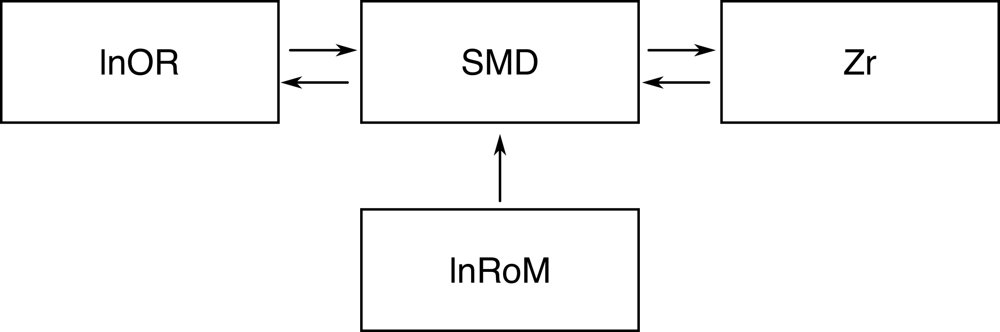

```{r}
#| eval: true
#| echo: false
#| output: false
#| out-width: "70%"

rm(list = ls())
library("metaDigitise")
library("ggplot2")
library("gt")
library("lubridate")
library("data.table")
library("ggpattern")
library("patchwork")
library("metafor")
library("dplyr")
library("broom")
library("broom.mixed")
library("simplermarkdown")
library("crayon")

file.copy("../package_development/metatools_dev/scripts/1_functions/convert_effect_sizes.R",
          "scripts/functions/convert_effect_sizes.R",
          overwrite = T)
file.copy("../package_development/metatools_dev/scripts/1_functions/eff_size.R",
          "scripts/functions/eff_size.R",
          overwrite = T)

# Source our custom functions:
source("scripts/functions/eff_size.R")
source("scripts/functions/convert_effect_sizes.R")

```

# Converting between effect sizes {#sec-effect-size-conversion}

Many effect sizes can be inter-converted [@borenstein2021; @Lajeunesse2026-ms] These conversions make assumptions and can bias the resulting effect types (see [@poom2022accuracy]) and should be carefully used—with sensitivity analyses to ensure that the conversions aren't unduly influencing results. 

At the same time, especially for questions with limited data, we believe that conversions are an important tool in the meta-analyst toolkit.

 These conversions have some numeric assumptions:


## Assumptions {#sec-assumptions}
There are a number of assumptions when converting effect sizes between each other. We summarize these in the table below as well as in each dedicated section. 


| Conversion  | Assumption                                    |
|-------------|-----------------------------------------------|
| lnOR ↔ SMD  |Response variable is a discretized version of an underlying continuous variable     |
| SMD ↔ Zr    |Predictor variable is a discretized version of an underlying continuous variable |
| SMD ↔ lnRoM |Homogeneity of variances between groups |

You'll note that the assumption for **lnOR ↔ SMD** concerns the response variable (i.e., dependent variable) while the assumption for **SMD ↔ Zr** concerns the predictor variable (indendent variable). This means that you can also convert lnOR to Zr via SMD and vice versa.

## Unit of replication alignment
In addition to these assumptions, be careful that the data is truly comparable, especially in terms of their units of replication---otherwise the converted effect size will have vastly higher or lower weights in the final meta-analytic model. 

For example, imagine you're analyzing the effect of an introduced predator on prey abundance. Some studies present abundance correlations of the predator and prey (Zr), where the unit of replication is the **number of surveys**. Other studies report the presence and absence of prey species on islands with and without the predator (lnOR), for which the unit of replication is **number of islands** (each of which was presumably surveyed many times).

Both of these study types are relevant to the same question--—the effect of the predator on prey abundance. Likewise, converting betwee these effect sizes does not violate the assumptions in the [table above](#sec-assumptions) because presence-absence is a discretized version of abundance. It is thus possible to convert these effect sizes via SMD to include both papers in the same model.

However, **the units of replication of these study types are vastly different** (study 1 = survey; study 2 = island). This will lead the Zr abundance correlations to have more weight than the full-island lnOR responses.

However, in many other cases, conversions will allow similar data to be compared without comparing different units of replication. 

Given the assumptions and potential biases involved in converting effect sizes, we recommend that you convert minority effect sizes to the dominant effect size in your analysis after confirming that assumptions are met and that the unit of replication for all the effect sizes are equivalent. We then recommend running your models with and without these converted effect sizes, to evaluate whether the inclusion of minority effect sizes alter your results.

:::callout-important
####### Alternative to conversion: reconstruct the underlying data {#sec-callout-reconstructing-data}
In some cases, converting between effect sizes can be prevented by reconstructing the underlying data of the author-presented summaries and summarizing these data into the desired analysis effect size, which can align the units of replication between studies. 

See examples for [SMD-type effect sizes](3.2-smd-challenges.qmd#sec-smd-reconstructing-data), [lnOR effect sizes](3.3-lnOR-challenges.qmd#sec-lnOR-reconstructing-data), [Zr effect sizes](3.4-Zr-challenges.qmd#sec-single-axis-error-bars), and for [non-Gaussian responses](6-simulating-non-gaussian-responses.qmd)
:::


## Helper function: `convert_effect_sizes` {#sec-helper-function}

We have digitized the primary conversion formulas and they are available in our `convert_effect_sizes()` function. Running the function on its own will return a table with the statistics required for each conversion.

```{r}
#| eval: true
#| echo: true

source("scripts/functions/convert_effect_sizes.R")

convert_effect_sizes()

```

To convert an effect size, specify the `from` effect type and the `to` effect type, as well as the required statistics:

We'll now show the math and demonstrate in R all conversions. SMD is the universal solvent of these conversions and it is important to remember that SMD has multiple estimators. The most commonly used is Hedges' $g$, which has a small sample size bias correction factor $J$. However, all conversion formulas convert to and from $d$, an alternative estimator of SMD that lacks this correction factor. For that reason, the math below will skip this conversion and be written for $d$ instead of $g$ based on this conversion. 


$$
\begin{aligned}
&J = 1-\frac{3}{4*(n_1 + n_2 - 2) - 1}\\
&d = \frac{m1-m2}{sd_{pooled}}\\
&d = \frac{g}{J}
\end{aligned}
$$
Note that the default sampling variance estimator for Hedges' g is the same estimator used for Cohen's d (in the R package `escalc`. Thus no conversion from Var(d) to Var(g) is necessary.

:::callout-important
####### Alternative estimators and effect size conversion {#sec-alternative-estimators}
As described [earlier](1-effect-size-overview.qmd#sec-alternative-estimators) in this tutorial, there are multiple flavors of estimators for many effect sizes including paired estimators and, for SMD, an estimator that tolerates heteroscedastic data ("SMDH"). To the best of our knowledge, there are no conversion formulas for these alterative estimators. 

This means that if you are converting Zr effect sizes to add to a meta-analysis that is otherwise composed of SMD-type effect sizes, you won't be able to use SMDH for the larger dataset. Conversely, if you have paired SMD-type data that you wish to convert to add to a meta-analysis of Zr effect sizes, you'll have to ignore the paired design.
:::

# SMD ↔ lnOR 

## SMD → lnOR {#sec-smd-lnOR}
This conversion assumes that the response variable is continuous (e.g., undergirding the binary response of the lnOR effect type) and that it has a logistic distribution (similar to a normal distribution).

If the lnOR data was presence/absence of a species and the SMD data was abundance, we believe this assumption is satisfied, given that presence/absence are the extreme ends of abundance.

Let $yi_{lnOR}$ and $yi_{d}$ be the point estimate for the lnOR and Cohen's d effect sizes and $vi_{lnOR}$ and $vi_{d}$ be their sampling variances:

$$
\begin{aligned}
&yi_{lnOR} = yi_d * \frac{\pi}{\sqrt{3}} \\
&vi_{lnOR} = vi_{d} * \frac{\pi^2}{3} \\
\end{aligned}
$$

In R:

```{r}
#| eval: true
#| echo: true
#| out-width: "70%"
convert_effect_sizes(from = "SMD",
                     to = "lnOR",
                     yi = 0.9,
                     vi = 0.01,
                     n1 = 15,
                     n2 = 15)

```


## lnOR → SMD {#sec-lnOR-smd}
To convert from lnOR to Cohen's $d$:

$$
\begin{aligned}
&yi_d = yi_{lnOR} * \frac{\sqrt{3}}{\pi} \\
&vi_d = vi_{lnOR} * \frac{3}{\pi^2} \\
\end{aligned}
$$

In R:
```{r}
#| eval: true
#| echo: true
#| out-width: "70%"
convert_effect_sizes(from = "lnOR",
                     to = "SMD",
                     yi = 0.9,
                     vi = 0.01,
                     n1 = 15,
                     n2 = 15)
```

# SMD ↔ Zr
## SMD → Zr {#sec-smd-zr}
This conversion assumes that a continuous variable was discretized to form the treatment and control groups of an SMD effect size. This may be the case in some situations (e.g., if treatment and control were based on the presence or absence of an independent variable treatment while the correlation was across a continuous gradient of the same variable).

To convert from SMD to Zr, we first convert $d$ to the correlation coefficient $r$ and then to Zr, using a correction factor $a$ for cases where $n_1 \neq n_2$. Let $yi_{Zr}$ and $yi_d$ be the point estimate for Zr and Cohen's d:

$$
\begin{aligned}
&a = \frac{(n_1 + n_2)^2}{n_1*n_2} \\
&r = \frac{yi_d}{\sqrt{yi_d^2 + a}} \\
&r \leftarrow \min(1, \max(-1, r_i))\\
&yi_{Zr} = atanh(r)\\
\end{aligned}
$$

And the sampling variance of Zr ($vi_{Zr}$):
$$
\begin{aligned}
&n = n1 + n2 \\
&vi_{Zr} = \frac{1}{(n - 3)} \\
\end{aligned}
$$

In R:
```{r}
#| eval: true
#| echo: true
#| out-width: "70%"
convert_effect_sizes(from = "SMD",
                     to = "Zr",
                     yi = 0.9,
                     vi = 0.01,
                     n1 = 15,
                     n2 = 15)
```


## Zr → SMD {#sec-zr-smd}
First, convert the point estimate of Zr ($yi_{Zr}$) to the correlation coefficient $r$ and calculate the variance of $r$ ($vi_r$:
$$
\begin{aligned}
&r = tanh(yi_{Zr}) \\
&vi_r = \frac{(1-r^2)^2}{(n-1)}
\end{aligned}
$$

Then calculate the point estimate ($yi_d$) and variance ($vi_d$) of Cohen's d:

$$
\begin{aligned}
&yi_d = \frac{2*r}{\sqrt{1-r^2}} \\
&vi_d = \frac{4*vi_r}{(1-r^2)^3} \\
\end{aligned}
$$

In R:
```{r}
#| eval: true
#| echo: true
#| out-width: "70%"
convert_effect_sizes(from = "Zr",
                     to = "SMD",
                     yi = 0.9,
                     vi = 0.01,
                     n = 50)

```

Note you can also calculate this directly from $r$ if preferred:

```{r}
#| eval: true
#| echo: true
#| out-width: "70%"
convert_effect_sizes(from = "r",
                     to = "SMD",
                     r = 0.5,
                     vi = 0.1,
                     n = 50)

```

# lnRoM → SMD {#sec-lnrom-smd}
Imagine you are conducting a meta-analysis using SMD as your effect size of choice due to negative values, dimensionality, or other concerns. During this meta-analysis you may encounter data reported directly as lnRoM (log-transformed ratio of means) alongside its sampling variance or standard error. Until recently, converting lnRoM effect sizes to SMD was mathematically impossible. However, @Lajeunesse2026-ms developed the mathematics to allow such conversion. This not only facilitates the extraction of data published as effect sizes to a common currency but can also facilitate secondary meta-analyses (e.g., meta-meta-analyses) by allowing conversion to the universal solvent of SMD.

The primary mathematical assumption of these conversions is homoscedasticity: that the variance of group 1 is similar to the variance of group 2. These may or may not be met in ecological data. There are additional risks as well: SMD represents linear scale effects as a difference between means whereas lnRoM represents multipicative effects, e.g., where treatment effects scale proportional to baseline levels. As with all conversions, sensitivity analyses are critical to ensure that this assumption isn't unduly influencing your results. 

Note that converting SMD to lnRoM remains unresolved.

As with the other conversions, we'll relay the math to convert between Cohen's d (the uncorrected estimator of SMD) and the uncorrected version of lnRoM. Our function, `convert_effect_sizes` automatically converts Cohen's to Hedges' g (the bias-corrected estimator of SMD).

Let $yi_{ROM}$ and $yi_{d}$ be the point estimates of lnRoM and SMD (after converting Hedges' g to Cohen's d) and $vi_{ROM}$ and $vi_{d}$ be their sampling variance estimates. Finally, let $n_1$ and $n_2$ be the numerator and denominator of lnRoM (e.g., the treatment and control groups respectively):

$$
\begin{aligned}
yi_d = (yi_{ROM} - 1) * \sqrt{\frac{n_1/yi_{ROM}^2 + n_2}{n_1 n_2 vi_{ROM}}}
\end{aligned}
$$

The sampling variance is estimated as follows. Note that this estimator is the same for Cohen's d and for Hedges' g (by default in `escalc`) as it is less biased and is thus the final estimated variance for SMD:

$$
\begin{aligned}
vi_{g} = \frac{1}{n_1} + \frac{1}{n_2} + \frac{yi_d^2}{2(n_1 + n_2)}
\end{aligned}
$$

In R:
```{r}
#| eval: true
#| echo: true

convert_effect_sizes(from = "lnRoM",
                     to = "SMD",
                     yi = 1.48,
                     vi = 0.1,
                     n1 = 25,
                     n2 = 25)

```
