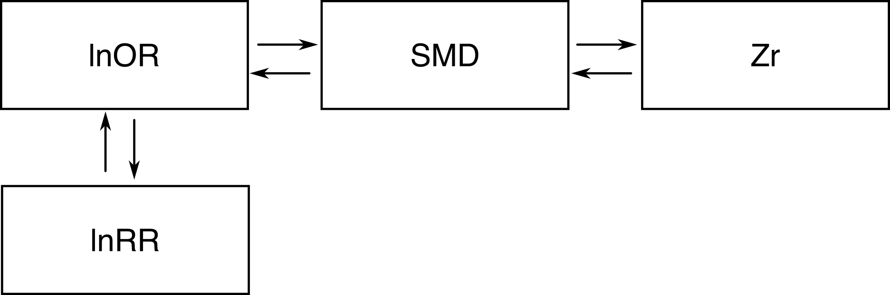

```{r}
#| eval: true
#| echo: false
#| out-width: "70%"

rm(list = ls())
library("metaDigitise")
library("ggplot2")
library("gt")
library("lubridate")
library("data.table")
library("ggpattern")
library("patchwork")
library("metafor")
library("dplyr")
library("broom")
library("broom.mixed")
library("simplermarkdown")
library("crayon")

# Source our custom functions:
source("scripts/functions/eff_size.R")
source("scripts/functions/convert_effect_sizes.R")

```

# Converting between effect sizes

Effect sizes can be inter-converted between SMD and lnOR and Zr [@borenstein2021]. Recently, Lajeunesse presented methods to convert lnRoM to and from SMD (**NEED TO DIGITIZE**).

 These conversions have some numeric assumptions:


| Conversion  | Assumption         |
|-------------|--------------------|
| lnOR ↔ SMD  |                    |
| SMD ↔ Zr    |                    |
| SMD ↔ lnRoM | Homoscedasticity?? |

**Not sure if assumptions go both ways**


In addition to these assumptions, be careful that the data is truly comparable, especially in terms of sample size. Imagine you're analyzing the effect of an introduced predator on prey. Some studies present abundance correlations of the predator and prey, where N is the number of surveys through time. Other studies present lnOR type presence/absence data across islands with and without the prey and the predator. The sample sizes of these study types are grossly different (n = survey; n = island). It does not seem justifiable to convert between the effect sizes, since the ultimate model will treat the Zr abundance correlations as having more weight than the full-island surveys (which are likely more biologically meaningful).

Converting between effect sizes should be done carefully and with many sensitivity analyses (e.g., running meta-analytic models with and without converted effect sizes).

We have digitized these conversion formulas and they are available in our `convert_effect_sizes()` function.

```{r}
#| eval: false
#| echo: true
source("scripts/functions/convert_effect_sizes.R")

convert_effect_sizes()

```

Running the function on its own will return a table with the statistics required for conversion. Here, we'll convert from SMD to Zr:

```{r}
#| eval: false
#| echo: true
convert_effect_sizes(from = "SMD", to = "Zr",
                     yi = 1.5, vi = .1,
                     n1 = 10, n2 = 10)
```

# SMD ↔ lnRoM

# SMD ↔ Zr

# SMD ↔ lnOR

# Zr ← SMD → lnOR
