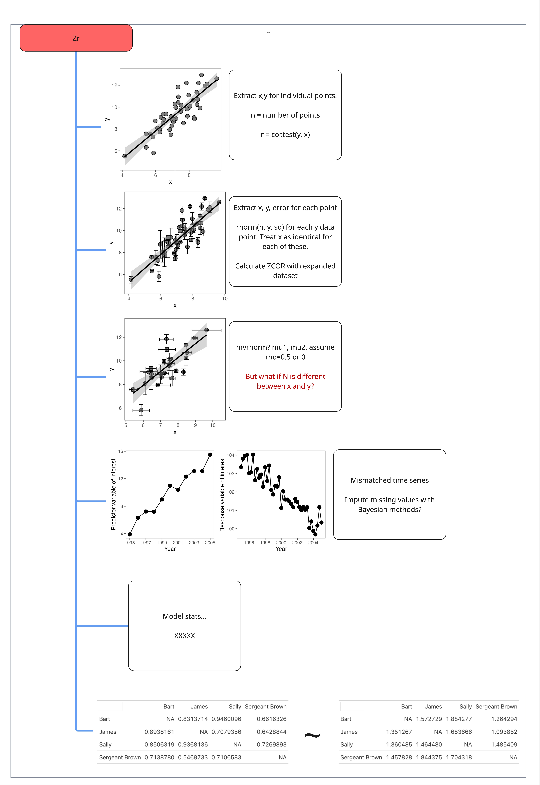

```{r}
#| eval: true
#| echo: false
#| out-width: "70%"

rm(list = ls())
library("metaDigitise")
library("ggplot2")
library("gt")
library("lubridate")
library("data.table")
library("ggpattern")
library("patchwork")
library("metafor")
library("dplyr")
library("broom")
library("broom.mixed")
library("simplermarkdown")
library("crayon")

# Source our custom functions:
source("scripts/functions/eff_size.R")
source("scripts/functions/convert_effect_sizes.R")

```

Zr describes the correlation between two continuous variables and is thus an important effect size in the meta-analyst tool kit. Zr type data often takes the form of a scatterplot but other formats exist (e.g., matrices, time series, and model estimates). We'll go through these examples in turn, along with solutions and limitations for extracting Zr type data.



## Simple figures

This is the simplest type of correlation figure. In this case, you'd calibrate the x and y axes and extract each point. Then use cor.test in R to calculate the correlation coefficient:

```{r}
#| echo: false
#| eval: true
#| out-width: "70%"

x <- rnorm(n = 50, mean = 7, sd = 1.2)
y <- x * 1.3 + rnorm(n = 50, mean = 0, sd = 1)

dat <- data.table(x = x, y = y, sd = abs(rnorm(n = 50, mean = 0, sd = .5)),
                  n = 10)

ggplot(data = dat, aes(x = x, y = y))+
  geom_smooth(method = "lm", color = "black")+
  geom_point(size = 3, shape = 21, fill = "grey50")+
  xlab("x")+
  ylab("y")+
  theme_bw()+
  theme(panel.grid = element_blank(),
        legend.position = "none")

```

Then calculate the Zr effect size in escalc:

```{r}
#| echo: true
#| eval: true

n = length(x)
out <- cor.test(x, y)
out$estimate

escalc(measure = "ZCOR",
       ri = out$estimate, ni = n)

```

## Overplotting

What if there is an ugly cluster of overlapping points?

```{r}
#| echo: false
#| eval: true
#| out-width: "70%"

x <- rnorm(n = 50, mean = 7, sd = 1.2)
y <- x * 1.3 + rnorm(n = 50, mean = 0, sd = 1)

dat <- data.table(x = x, y = y, sd = abs(rnorm(n = 50, mean = 0, sd = .5)),
                  n = 10)
dat.sub <- dat[rep(5, 12), ]
dat.sub$x <- jitter(dat.sub$x, amount = .05)
dat.sub$y <- jitter(dat.sub$y, amount = .05)

ggplot(data = dat, aes(x = x, y = y))+
  geom_smooth(method = "lm", color = "black")+
  geom_point(size = 3, shape = 21, fill = "grey50")+
  geom_point(data = dat.sub, aes(x = x, y = y), fill = "hotpink",
             shape = 21, size = 3)+
  xlab("x")+
  ylab("y")+
  theme_bw()+
  theme(panel.grid = element_blank(),
        legend.position = "none")

```


In these cases, if the total number of points (N) is reported for the study, then you can duplicate the values of the red points as many times as it takes to match the total sample size. Otherwise, you'll just have to digitize as many as you can and use an N that is less than the real N (which makes the overall Zr estimate more conservative—e.g., less weight in the model). For example, in the figure above, we could safely eyeball 5 separate points (though in reality there are 12).

## Single axis error bars

But what do you do if each point is actually a mean±SD?

```{r}
#| echo: false
#| eval: true
#| out-width: "70%"

ggplot(data = dat, aes(x = x, y = y))+
  geom_point(size = 3, shape = 21, fill = "grey50")+
  geom_errorbar(width = .25, aes(ymin = y-sd, ymax = y+sd))+
  geom_smooth(method = "lm", color = "black")+
  xlab("x")+
  ylab("y")+
  theme_bw()+
  theme(panel.grid = element_blank(),
        legend.position = "none")

```

If the error bars are only on the y axis this is fairly straightforward but is a bit surprising. In this case, each point actually has an internal-N, which will need to be gleaned from the methods of the paper. After determining this internal-N, extract the means and SDs for each point, and then draw a distribution of internal-N for each point with an appropriate distribution. Here we'll demonstrate using `rnorm` to draw normally distributed data for each point.

```{r}
#| echo: true
#| eval: true

head(dat)

y_expanded <- list()

for(i in 1:nrow(dat)){
  y_expanded[[i]] <- data.table(y = rnorm(mean = dat$y[i],
                                          sd = dat$sd[i],
                                          n = dat$n[i]),
                                x = dat$x[i])
}
y_expanded <- rbindlist(y_expanded)

y_expanded

```

In this example data, each point had an internal N of 10 measurements. Notice that the original dataset went from 50 rows (individual points) to 500 rows (50 \* 10). We then take this expanded dataset and calculate our correlation coefficient and effect size:

```{r}
# Now calculate 'r':
out <- cor.test(x, y, data = y_expanded)
n <- nrow(y_expanded)

escalc(measure = "ZCOR",
       ri = out$estimate,
       ni = n)
```

Pretty neat, right?

If the variable of interest (the response variable `y`) is not Guassian (e.g., is not normally distributed) but is count (Poisson) or overdispersed count data (negative binomial), etc, then you need to draw the underlying data with the appropriate distribution (e.g., `rpois` or `rnbinom`). Doing so requires converting author-provided summary statistics (e.g., the mean and standard deviation in the figure above) to the distribution-specific parameters. See @sec where we demonstrate this for negative binomial data.

However, in this example (and the one below) doing this assumes that the internal measurements of each point are at least somewhat independent—at least as independent as the sample N for other studies in your meta-analysis. If the internal measurements of these points are far less independent than in other studies in your meta-analysis then you may want to calculate the correlation just on the point means, and ignore the standard deviation. These decisions require a degree of thoughtfulness and good documentation to ensure consistency, especially when extracting data from a diversity of (messy) ecological studies.

## x and y axis error bars

What do you do if there are also error bars on the x axis? For example, if each point is a mean±SD of two different measurements. This is common in field studies, where researchers may sample vegetation at a site and some other factor (e.g., animal activity or soil nutrients) and then present the means±SD of each site in a correlation.

```{r}
#| echo: false
#| eval: true
#| out-width: "70%"

dat[, x_sd := abs(rnorm(50, mean = 0, sd = .25))]
setnames(dat, "n", "y_n")
setnames(dat, "sd", "y_sd")

dat[, x_n := 20]

ggplot(data = dat[sample(25)], aes(x = x, y = y))+
  geom_point(size = 3, shape = 21, fill = "grey50")+
  geom_errorbar(width = .25, aes(ymin = y-y_sd, ymax = y+y_sd))+
  geom_errorbarh(aes(xmin = x-x_sd, xmax = x+x_sd), height = .25)+
  geom_smooth(method = "lm", color = "black")+
  xlab("x")+
  ylab("y")+
  theme_bw()+
  theme(panel.grid = element_blank(),
        legend.position = "none")
```

In this case, you'll do approximately the same thing. Except that you need to choose a single internal-N (for the rows of the expanded x and y variables to align). The most conservative choice would be the N with the lowest sample size between the x and the y variable.

```{r}
#| echo: true
#| eval: true
head(dat)

# Choose the n with the lowest sample size:
dat[, n := min(c(x_n, y_n))]

xy_expanded <- list()

for(i in 1:nrow(dat)){
  xy_expanded[[i]] <- data.table(y = rnorm(mean = dat$y[i],
                                           sd = dat$y_sd[i],
                                           n = dat$n[i]),
                                 x = rnorm(mean = dat$x[i],
                                           sd = dat$x_sd[i],
                                           n = dat$n[i]))
}
xy_expanded <- rbindlist(xy_expanded)

cat(md_table(head(xy_expanded)))
```

Our dataset went from 50 rows (one per point in the figure above) to 500 rows, given an internal N of 10 per point.

Now, we calculate the correlation between all of these points and calculate our 'Zr' effect size:

```{r}
#| echo: true
#| eval: true
# Now calculate 'r':
out <- cor.test(x, y, data = xy_expanded)
n <- nrow(y_expanded)

escalc(measure = "ZCOR",
       ri = out$estimate,
       ni = n)

```

## Mismatched time series

Sometimes the factors of interest that you want to correlate are in separate graphs as time series. In these cases, it's just the tedious task of extracting data from each and aligning the two variables.

However, what do you do if the time series are mismatched?

Below, we'll plot two time series, one for Variable 1 and one for Variable 2:

```{r}
#| eval: true
#| echo: false
#| out-width: "70%"

library("lubridate")

x1 <- seq(from = 1995, to = 2005, by = 1)
x2 <- seq(from = 1995, to = 2005, by = .25)

y1 <- seq(from = 5, to = 15, by = 1)
y1 <- y1[1:11] 
y1 <- y1 + rnorm(n = 11, mean = 0, sd = .5)
# plot(x1, y1)

#
y2 <- seq(from = 100, to = 110, by = .1)
y2 <- y2[1:length(x2)]
y2 <- y2 + rnorm(n=length(x2), mean = 0, sd = .5)
# plot(x2, y2)

# slopes2 <- rnorm()
dt1 <- data.table(x1 = x1,
                  y1 = y1)
dt2 <- data.table(x2 = x2,
                  y2 = rev(y2))

p1 <- ggplot(data = dt1, aes(x = x1, y = y1))+
  geom_path()+
  geom_point(size = 3)+
  xlab("Year")+
  ylab("Variable 1")+
  theme_bw()+
  scale_x_continuous(breaks = seq(from = min(dt1$x1), to=max(dt1$x1), by = 2),
                     labels = as.integer(seq(from = min(dt1$x1), to=max(dt1$x1), by = 2)))+
  theme(panel.grid = element_blank(),
        legend.position = "none")
# p1

#
dt2[, date := date_decimal(x2) |> as.Date()]
p2 <- ggplot(data = dt2, aes(x = date, y = y2))+
  geom_path()+
  geom_point(size = 3)+
  xlab("Year")+
  ylab("Variable 2")+
  theme_bw()+
  # scale_x_continuous(breaks = seq(from = min(dt1$x1), to=max(dt1$x1), by = 2))+
  theme(panel.grid = element_blank(),
        legend.position = "none")
# p2

p1 + p2

```

What is the best way to line up variable 1 and variable 2 to calculate their correlation? rWhile imputing the missing values in the second panel is one possible approach, it is the least conservative. Instead, we recommend taking the average of the most frequently sampled variable to align with the less frequently sampled variable. Alternatively, you can filter the data (after aligning by the shared x-axis) to just those occassions where there is data for both series.

## Matrices

Some types of correlations are more complicated because they are actually based on matrix algebra. For instance, correlations between pair-wise behaviors. Imagine, that individuals engage in pairwise, activities, such as grooming each other. A long-standing question has concerned whether these behaviors are adaptive and potentially increase the chance that an individual will protect another individual. 

In this case, you might have a matrix of grooming between individuals:

```{r}
#| eval: true
#| echo: false
#| out-width: "70%"

# devtools::install_github("ddsjoberg/bstfun")
library("gt")
library("ggplotify")

mat1 <- matrix(runif(16, min = 1, max = 100), nrow = 4, ncol = 4)
mat1[lower.tri(mat1, diag = TRUE)] <- NA
colnames(mat1) <- c("Sally", "James", "Bart", "Sergeant Brown")
row.names(mat1) <- c("Sally", "James", "Bart", "Sergeant Brown")

mat2 <- matrix(runif(16, min = 1, max = 100), nrow = 4, ncol = 4)
mat2[lower.tri(mat2, diag = TRUE)] <- NA
colnames(mat2) <- c("Sally", "James", "Bart", "Sergeant Brown")
row.names(mat2) <- c("Sally", "James", "Bart", "Sergeant Brown")

mat1

```

And a matrix of defending each other from adversaries:

```{r}
#| echo: false
#| eval: true
#| out-width: "70%"

mat2
```

How do you go about analyzing such data? For an example of a meta-analysis on this topic, see Schino (2007) https://doi.org/10.1093/beheco/arl045.

First, you need to melt these matrices into vectors and align the pairs:

```{r}
mat1 <- reshape2::melt(mat1, na.rm = T)
mat2 <- reshape2::melt(mat2, na.rm = T)

mat1
```

Then, calculate Kendall's correlation coefficient:

```{r}
res <- cor.test(mat1$value, mat2$value, method = "kendall")
res
```

And now you're free to calculate ZCOR:
```{r}
escalc(measure = "ZCOR", 
       ri = res$estimate,
       ni = nrow(mat1))
``` 

**IS THIS CORRECT???**

## Model estimates

....
